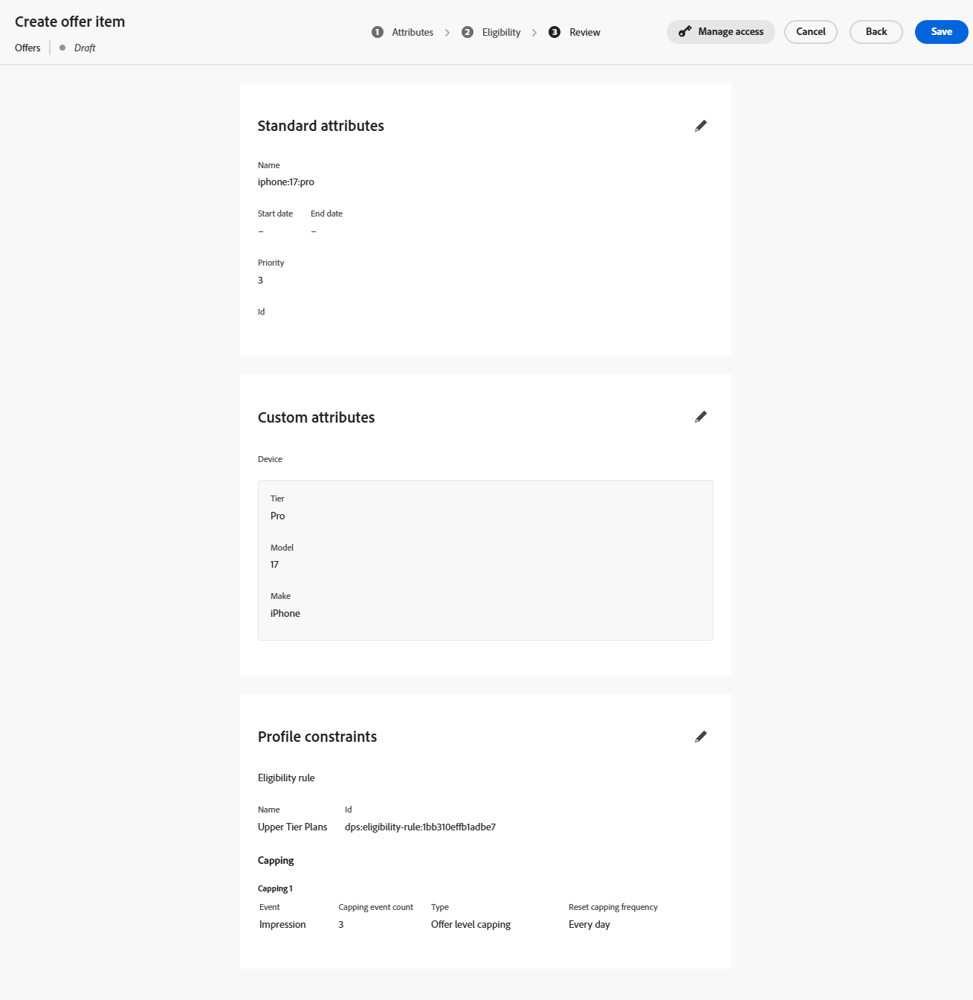

# 创建优惠项目

## 目标

在此部分中，您将创建基于代码的体验(CBE)将返回给请求客户端的实际选件项目。 某些选件项目将具有资格要求和频率上限，而其他项目则没有。

## 方案概述

但是，在创建选件项目之前，下面是一些有关我们方案的快速提醒。 首先，我们的方案中有3个iPhone 17层：Ultra、Pro和Base。 您总共创建4个选件（每个层1个），外加一个通用后备选件，接收系统可使用该后备选件显示所有层的iPhone 17的一般信息。

其次，只有计划ID为2或3的客户才有资格使用Ultra和Pro级别电话。

接下来，该公司要求每个报价每天只显示3次，然后才会显示下一款较低级别的手机。

最后，如果一切条件都一样， Connection 5G希望销售Ultra层，然后销售Pro ，再销售基本型号。 因此，当为每个选件项目赋予优先级分数时，您会看到这些优先级显示。

## 创建默认/后备优惠项目

您创建的第一个也是最简单的选件项目是后备选件，任何人都可以无限期地查看该后备选件。

1. 如有必要，请在左边栏中展开&#x200B;**决策**，然后单击&#x200B;**目录**
2. 此时将显示一个空的选件页面：

在创建任何优惠项之前

3. 单击蓝色的&#x200B;**创建项**&#x200B;按钮。 这将打开“创建选件项目”页面。
4. 在“选件名称”字段中输入文本&#x200B;**iphone：17\：generic**。 如果您愿意，请输入描述。

>[!NOTE]
>
>全小写、冒号分隔的命名惯例只是我们自己的设计之一，可以作为实际客户遵循的命名惯例。 实际上，您可以为选件项目开发不同的命名策略。 在创建选件项之前，请确保已记录并保持一致。 这将确保优惠项目在收藏集中轻松查找和分组。 稍后将对此进行详细介绍。

5. 由于这是最低优先级/默认选件项目，因此将默认优先级保留为1。

>[!NOTE]
>
>在Decisioning中，数字越小，优先级越低。 例如，优先级为100的选件项显示在优先级为1的选件项之前

6. 展开“自定义属性”区域中的&#x200B;**设备**&#x200B;项，然后在文本框中输入以下信息：
   - 层： **通用**
   - 模型： **17**
   - 制作：**iPhone**

这些是实际的文本值，用于描述优惠以及可用于排序、排名和资格标准的内容。 它们也是可以返回到请求设备的文本值。

将通用选件的

>[!NOTE]
>
>您展开的设备区域与上一部分中使用自定义属性更新“个性化优惠项目 — Experience Decisioning”架构时创建的“设备”父对象相同。 Tier、Model和Make字段是添加的单个属性：
>
>

>[!WARNING]
>
>上一部分提到将自定义属性添加到系统生成的“个性化优惠项目 — Experience Decisioning”架构时需要格外小心。 以后每个选件项目都可能会将每个额外的自定义节点显示为可能的字段。 创建不必要的或特定于营销活动的属性将使选件项目创建UI混乱，并且可能会导致混淆。

7. 单击右上角的蓝色&#x200B;**下一步**&#x200B;按钮以进入下一步。
8. 此选件应该可供所有人/所有访客使用，并且没有任何频率上限，因此无需更改“资格”或“上限”部分。 再次单击蓝色的&#x200B;**下一步**&#x200B;按钮以继续执行最后一步。
9. 在“查看”步骤中，验证所有数据是否正确：

10. 进行任何必要的更改。 准备就绪后，单击蓝色的&#x200B;**保存**&#x200B;按钮。
11. 保存后，将出现一个白色“批准”按钮，其中以前是“保存”按钮。 单击白色&#x200B;**批准**&#x200B;按钮以批准此选件项。 您在选件项目标题下方看到一个绿色的“已批准”指示器：

通用优惠项目上的

>[!NOTE]
>
>实际上，对于更复杂的选件，应该设置适当的审批流程以确保正确创建选件项目。 为节省本实验时间，您只需批准您创建的每个选件项即可。

12. 单击选件项标题旁边的&#x200B;**向左箭头**&#x200B;以返回“选件”页面，此时您会看到iphone：17\：generic选件已列出。

## 创建基本模型优惠项

现在已创建了通用选件项，您可以为iPhone 17的基本模型创建下一个优先级选件项。

1. 再次单击蓝色&#x200B;**创建项**&#x200B;按钮并命名选件&#x200B;**iphone：17\：base**
2. 由于这是下一个优先级最低的选件项，因此请将&#x200B;**优先级**&#x200B;字段增加到&#x200B;**2**
3. 展开&#x200B;**设备**&#x200B;区域并为字段指定以下值：
   - 层： **Base**
   - 模型： **17**
   - 制作：**iPhone**

完成后，选件项目将如下所示（为确保优先级正确而添加了红色框）：

当一切正确时，单击蓝色的&#x200B;**下一步**&#x200B;按钮以继续执行下一步。

4. 此选件项目应可供所有人使用，因此没有资格要求；但是，每日展示次数应限制为3次。 单击“**+创建上限”**&#x200B;按钮。
5. 在新上限规则上，将&#x200B;**选择上限事件**&#x200B;更改为&#x200B;**展示。**
6. 将&#x200B;**上限事件计数**&#x200B;更改为&#x200B;**3**。 完成后，您的上限规则将如下所示：

基础选件的上限规则设置为3次展示](assets/create-offer-items-base-offer-capping-rule.png)![

更正后，单击蓝色的&#x200B;**创建**&#x200B;按钮以保存上限规则。

>[!NOTE]
>
>请注意如何创建其他上限规则。 实际上，您可能希望添加多个规则。 在这种情况下，我们本可以添加一个规则，在看到特定事件（例如购买事件）时对此进行限制。 本实验通过单个上限规则来简化操作。
>
>

> [!NOTE]
>
>频率上限规则中提到的“天数”是指GMT时区的天数。  逻辑中以天为单位的频率上限会在格林威治标准时间午夜重置。

7. 单击&#x200B;**下一步**&#x200B;以继续执行审阅步骤。
8. 确保一切按预期显示，然后单击&#x200B;**保存**&#x200B;按钮。 保存后，单击&#x200B;**批准。**
9. 获得批准后，单击标题旁边的左箭头并返回选件页面。 现在，您会看到两个选件，每个选件具有相应的优先级。

## 创建上层模型优惠项

现已创建类属模型和基本模型选件，您可以移至专业模型和超模型的选件项目。 这些优惠项目还需要包含资格元素，因为只有具有特定计划级别的成员才能看到这些优惠。

1. 按照上述各节中介绍的相同步骤和命名模式，创建一个名为&#x200B;**iphone：17\：pro**&#x200B;的新选件，并将其优先级设置为&#x200B;**3.**
2. 将&#x200B;**Tier**&#x200B;属性设置为&#x200B;**Pro**&#x200B;和其他自定义属性，就像在其他选件中所做的那样。
3. 在“资格”步骤中，选择&#x200B;**按规则**&#x200B;单选按钮。
4. 左边栏只显示一个决策规则，即之前创建的称为“上层计划”的决策规则。 单击该规则旁边的&#x200B;**+**&#x200B;图标以将其添加到画布。
5. 如前所述，该企业已声明，非后备优惠的频率上限应为每天3次显示（或展示次数）。 按照上一节中的步骤，为每天3次展示创建上限规则。 完成后，您的页面将如下所示：

6. 验证所有内容均正确后，单击&#x200B;**下一步**。 最终的选件项目配置如下所示：

已完成

7. 一切看起来正确后，**保存**&#x200B;和&#x200B;**批准**&#x200B;优惠项目。
8. 返回到“选件”页面，并验证是否存在3个选件以及它们各自的优先级是否正确。
9. 创建最终选件项并将其命名为&#x200B;**iphone：17\：ultra，**，将其优先级设置为&#x200B;**4，**，并将其他自定义属性的值设置为与其他选件相同的值。
10. 与最后一个优惠项一样，将资格设置为“上层计划”决策规则，并将频率上限设置为每天3次展示。 完成后，您的选件项目将如下所示：

11. 确认所有设置均正确后，保存并批准此选件项目。 您现在可以看到所有四个选件项目，每个项目都具有唯一的优先级。

>[!NOTE]
>
>本实验的说明着重于确保每个选件项目的优先级不同。 在这个简单的用例中，这非常重要，但UI中没有任何内容会强制您为每个选件项目指定唯一的优先级。 随着时间的推移，您可能会有多个具有相同优先级的选件项目。 您将在后续章节中了解为什么这一点很重要。

## 回顾

您为不同的iPhone 17层定义了多个选件，包括一个通用后备选件和特定于层的选件（基本、专业和ultra）。 您还批准了具有正确优先级、资格和展示次数上限设置的所有四个优惠项目，以便它们可以在您的决策包中使用。
