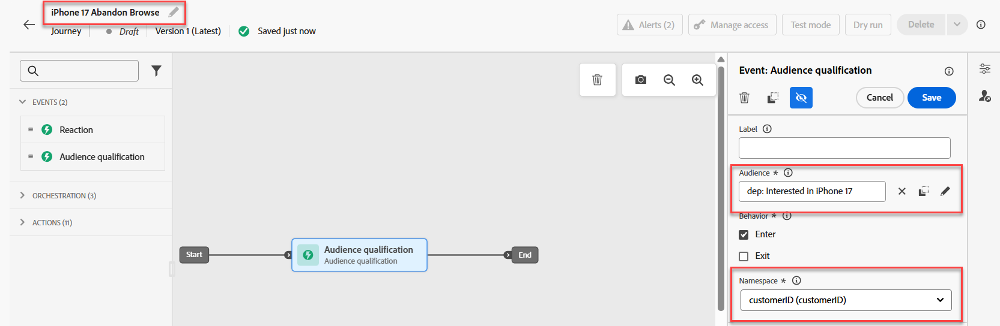
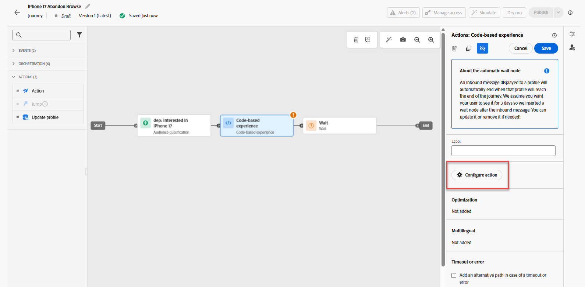

# 创建历程

## 命名并定义准入标准

1. 如有必要，请展开左边栏中的&#x200B;**历程管理**&#x200B;菜单项，然后单击&#x200B;**历程**。 你登陆“历程”页面。
2. 单击蓝色的&#x200B;**创建历程**&#x200B;按钮。
3. 显示“创建历程”叠加图时，选择&#x200B;**从头开始创建**，然后单击&#x200B;**确认**
4. 在右边栏中，将历程命名为&#x200B;**iPhone 17 Abandon Browse**，然后单击蓝色的&#x200B;**保存**&#x200B;按钮，以便开始向历程画布添加操作。
5. 将&#x200B;**受众资格**&#x200B;事件拖动到画布上。
6. 在右边栏中，单击&#x200B;**铅笔**&#x200B;图标以选择此事件的受众。
7. 选择&#x200B;**dep：对iPhone 17**&#x200B;受众感兴趣。
8. 确保&#x200B;**Namespace**&#x200B;下拉列表设置为&#x200B;**customerID。** 此时，您的历程将如下所示：



&#x200B;9. 当每个人看起来都正确后，单击蓝色的&#x200B;**保存**&#x200B;按钮以保存进度。

>[!NOTE]
>
>“dep：对iPhone 17感兴趣”受众是一个流式受众，其中进入标准为在同一天三次查看虚构的Connection 5G iPhone 17概述页面。 与许多产品概述页面一样，Connection 5G的iPhone 17概述页面是一个动态页面，具有多个元素，这些元素会更新而无需重新加载页面。 您可以在此单页上比较iPhone 17的各个层及其功能。 因此，如果某个人在当天查看此页面3次，则他们可能会对iPhone 17感兴趣。 但是，由于页面并非每个元素都进行了标记和测量，因此Connection 5G将利用经过身份验证的用户的年龄来确定在与Connection 5G品牌的不同接触点交互时向他们显示的电话级别。


## 配置CBE和决策策略

1. 展开画布左侧的&#x200B;**操作**&#x200B;折叠面板，将&#x200B;**操作**&#x200B;元素拖动到画布上，并将其连接到第一个节点。
2. 显示“选择操作类型”叠加图时，选择&#x200B;**基于代码的体验**&#x200B;操作，然后单击蓝色的&#x200B;**添加**&#x200B;按钮。
3. 在现在可见的“Action\：Code-based Experience”属性中，单击&#x200B;**配置操作**&#x200B;按钮。

使用“配置操作”按钮

&#x200B;4. 将&#x200B;**基于代码的配置**&#x200B;下拉列表更改为您在上一部分中创建的&#x200B;**jsonOffer\_cbe** cbe。


&#x200B;5. 单击“基于代码的配置”下拉列表上方的&#x200B;**编辑内容**&#x200B;按钮。
&#x200B;6. 在生成的基于代码的体验编辑器屏幕上，单击&#x200B;**编辑代码**&#x200B;按钮。 生成的屏幕是您添加返回到体验事件请求的JSON的位置


&#x200B;7. 在代码编辑器的最左侧，单击&#x200B;**决策策略**&#x200B;菜单项，然后单击新菜单中的&#x200B;**添加决策策略**&#x200B;按钮。


>[!NOTE]
>
>如果选择策略是将优惠收藏集绑定到排名方法（并应用策略级资格）的地方，则决策策略是将选择策略绑定到渠道的特定投放的地方。

&#x200B;8. 将此决策策略命名为&#x200B;**iPhone 17 DP**，并将“项目数”保留为1。

>[!NOTE]
>
>到目前为止，您已配置选件以及如何对其进行排序，但尚未配置要返回的数量。 您可以在此处配置应返回的选件数量。

&#x200B;9. 单击蓝色的&#x200B;**下一步**&#x200B;按钮。 这是添加选择策略的位置。 单击“**+添加**”按钮（可能需要向下滚动才能看到它），然后选择“**选择策略**”。
&#x200B;10. 勾选您应拥有的唯一选择策略旁边的框（**iPhone 17选择策略**），然后单击&#x200B;**保存**。 完成后，您会看到以下内容：

已为决策策略选择

>[!NOTE]
>
>请注意如何添加多个选择策略或仅添加决策项目本身。 何时会使用多种选择策略？ 假设您的某个数字资产上有一个4 X 4推荐网格。 您希望用16个选件填充所有这些选件。 您可能会让这些选件分散在几个收藏集中，或者前两行需要一个选择策略，而后两行则需要不同的策略。 在上一个屏幕中，您选择了16个，然后使用此屏幕根据需要添加任意数量的选择策略或选件，直至达到16个。
>
>后备优惠是可选的，因为它只有在最终用户可能不符合任何优惠资格时（或变为）才适用。 在本例中，我们的选择策略是针对所有访客的，只有进入历程的用户才能到达CBE节点。 进行身份验证是历程进入的一个要求（在历程中设置的命名空间是他们只有在进行身份验证后才会拥有的命名空间）。 我们还在Ranking公式中内置了后备优惠，因此在本例中，无需设置此后备优惠。

&#x200B;11. 单击蓝色的&#x200B;**下一步**&#x200B;按钮以查看决策策略。

在创建决策策略之前

&#x200B;12. 一切看起来正确后，单击蓝色的&#x200B;**创建**&#x200B;按钮。 创建后，您将返回到表达式编辑器页面。
&#x200B;13. 您应该会看到类似于下面的屏幕；如果没有，请再次单击&#x200B;**决策策略**，然后您会看到您的决策策略出现。

显示决策策略的

&#x200B;14. 单击&#x200B;**+插入策略**&#x200B;按钮，代码编辑器中将显示一个ForEach循环：

插入决策策略后插入到代码编辑器中的

>[!NOTE]
>
>为什么每个循环使用？ 在我们的例子中，我们只返回了一个选件。 但是，请考虑之前我们可以返回多个选件的步骤。 在考虑功能时，此处的循环机制是合理的。

&#x200B;15. 在循环范围内添加有效的JSON以返回应提供给最终用户的手机的品牌、型号和层。 由于还设置了频率上限，因此需要将trackingToken添加到响应。 稍后在说明中会对此进行详细介绍。 要节省时间，只需将这些行代码复制并粘贴到For Each循环中的代码编辑器中：

```javascript
   {
        "make":"",
        "model":"",
        "tier":"",
        "trackingToken":""
    },
```


>[!NOTE]
>
>请记住，您已将属性添加到标准选件XDM架构中，特别是品牌、模型和层。 然后，在创建选件时填充这些属性。 您现在可以将这些属性添加为变量，并用选定选件的值填充这些变量。 trackingToken字段是系统生成的值，用于跟踪点击次数和展示次数。

&#x200B;16. 将光标置于&#39;make&#39;节点的&#x200B;**&quot;**&#x200B;之间。 通过在决策策略菜单中导航到&#x200B;**\_dep > Device > Make**&#x200B;节点，插入优惠的品牌。  单击&#x200B;**Make**&#x200B;元素上的&#x200B;**+**&#x200B;图标，您会看到它填充编辑器。


&#x200B;17. 以类似方式添加&#x200B;**模型**&#x200B;和&#x200B;**层**&#x200B;属性。
&#x200B;18. 单击属性导航中的&#x200B;**决策策略**&#x200B;以返回到根级别。
&#x200B;19. 通过&#x200B;**\_experience > decisioning > decisionitem >跟踪令牌**&#x200B;路径导航到跟踪令牌值来填充trackingToken属性。
&#x200B;20. 最后，将整段代码封装在一组方括号(**\[]**)中。 您最终的JSON代码应如下所示：


>[!WARNING]
>
>确保在整个决策项目两侧都包含括号“\[ ]”。 困惑？ 请再次参阅第#20步。


&#x200B;21. 查看上面的屏幕快照后，单击右上角的&#x200B;**保存并关闭**&#x200B;以保存您的代码。 然后，您将返回到基于代码的体验页面。
&#x200B;22. 单击历程名称旁边的向后箭头&#x200B;**\&lt;**&#x200B;图标，您将返回到画布。

从基于代码的历程编辑器返回后

&#x200B;23. 单击蓝色的&#x200B;**Save**&#x200B;按钮以保存CBE操作节点。 您的历程现在看起来像这样：


&#x200B;24. 完成历程后，单击右上方的蓝色&#x200B;**发布**&#x200B;按钮，并在出现确认框时再次单击&#x200B;**发布**。 过了一两会儿，您会看到您的历程现已上线！


>[!TIP]
>
>您的历程现在已准备好为此决策包提供JSON选件！

>[!NOTE]
>
>为什么在画布上放置CBE后会自动创建等待节点？ 请记住，CBE是一个入站渠道。 与主动发送给最终用户的电子邮件或推送通知不同，CBE会推送到Edge，并在那里等待最终用户访问数字资产并请求提供选件。 该等待节点会定义等待时间。 默认情况下，它被设置为3天，但它是可配置的。 本实验保留为3天，但在现实场景中，您可能希望将其延长更长时间，因为等待时间过后，该用户的历程会前进到结束节点，并且会从该用户的Edge配置文件存储中删除CBE。
>
>这也突显出一个重要的架构和时间因素。 何时会将该用户的CBE推送到Edge配置文件存储区？ 当用户前进到该节点时，这意味着在用户符合区段资格后。 这意味着，在用户查看了第三页之后，在流分段执行之前，它将在几秒钟到几分钟的任意时间内，将用户置于该区段中，用户进入旅程并转到CBE节点，然后为该用户将CBE投影到Edge。  在数据和处理需求非常少的测试组织中，整个过程只需要几秒钟或几分钟。 对于吞吐量高得多的大型组织，计划时间至少为15分钟，可能长达2小时。


## 回顾

在此页面中，您配置了基于代码的体验(CBE)渠道，该渠道使外部系统能够通过API样式的入站渠道请求优惠决策。 该设置包括指定客户端系统将发送的表面/位置参数，以及选择JSON输出格式。
