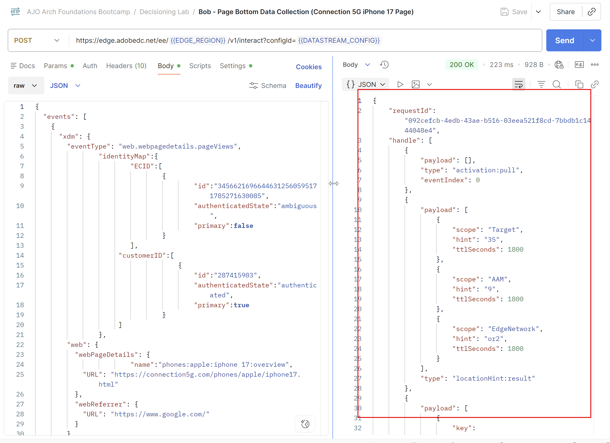

# 决策和CBE的实际操作

## 目标

现在历程已上线，您可以开始发送体验活动并查看返回的优惠。 由于各个用户档案的出生年份和电话计划ID会影响返回的选件，因此我们必须为具有特定出生年份和计划ID的预配置用户档案发送体验事件。

## 配置文件和Postman设置

您的沙盒中已存在您将使用的三个配置文件，此表概述了它们：

| 名字 | 姓氏 | 出生年份 | 计划ID | 客户ID | ECID | 电子邮件 |
| ---------- | ------------ | ---------- | ------- | ---------- | -------------------------------------- | --------------- |
| 鲍勃 | 基本 | 1974 | 1 | 287415903 | 34566216966446312560595171785271630085 | bob\@dep.com |
| Peter | 专业 | 1981 | 2 | 105946728 | 22344522145769262754334953788432801285 | peter\@dep.com |
| Ursula | Ultimate | 2002 | 3 | 730682145 | 35615467908312308343036144243711275069 | ursula\@dep.com |

在AEP中找到这些配置文件

1. 如有必要，请展开左边栏中的&#x200B;**客户**&#x200B;项目，然后单击&#x200B;**配置文件**
1. 单击&#x200B;**浏览**&#x200B;选项卡，在您已经创建的所有配置文件中，或者您作为以前实验的一部分创建的所有配置文件中，您会看到这三个配置文件。

在Postman收藏集中查找每个用户档案的相应Experience Events

1. 如有必要，请打开Postman
1. 确保仍设置&#x200B;**EDGE\_REGION**&#x200B;和&#x200B;**DATASTREAM\_CONFIG**&#x200B;环境变量。 如果需要再次设置环境变量，请查看“导入环境和收集”实验室中的步骤。
1. 展开&#x200B;**决策实验室**&#x200B;文件夹。 对于每个配置文件，您会看到2个体验事件：

## 发送体验事件

> [!IMPORTANT]
>
>请勿跳过此部分的开始文本说明！

如果时间和资源不受限制，我们会让您在实际网站上使用AEP Web SDK构建和部署标记库。 这将演示如何检索和报告选件。 但是，鉴于这些实验室中涵盖的内容十分广泛和深入，我们选择预先构建进入历程、检索选件和在Postman收藏集中报告这些选件所需的体验事件，而不是要求您标记网站。 正确使用时，此收藏集会模拟正确标记的网站（或任何数字渠道）如何在历程中使用CBE投放渠道。

AEP Web SDK部署的推荐方法是使用每页面两次调用方法。 在此模式中，Web SDK会在页面顶部向Edge发送“获取”调用，以请求用户所需的任何个性化。 这些个性化由Edge返回，然后由Web SDK渲染。 随后会将页面底部的第二个调用（通常称为数据收集调用）发送到Edge，并报告向最终用户显示的内容，以及Analytics、CJA和其他解决方案的其他数据。 从Edge中检索建议时，请记住一个简单的助记符：FAR，表示“获取”、“应用”和“报告”。 必须获取、应用或呈现所有建议（向最终用户显示），然后对其进行报告。 至关重要的是，要将这些选件报告为可见，以便频率上限规则正常工作。

Adobe Target活动和AJO Web Channel可以由AEP Web SDK自动获取和应用其响应。 他们的报告也可以随页面底部的数据收集调用一起发送。 但是，CBE是不同的。 AEP Web SDK可以获取建议，但由客户决定是否应用（渲染）返回的任何内容，然后使用AEP Web SDK来报告所显示的内容。 CBE通常不使用数据收集调用来报告所显示的内容，因此必须手动传入这些调用。

在Postman集合中，您将看到每个配置文件有两个Experience Event调用

A Page Top获取体验事件

Page Bottom数据收集体验事件

页面顶部体验事件在请求中包含“jsonOfferContainer”参数，它是您为CBE配置的“页面上的位置”。 此外，此调用使用Postman的脚本功能从Edge中获取响应，然后立即向Edge报表发送第二个调用，从而向最终用户显示选件。 由于本实验没有网站，因此没有实际应用或呈现选件。 但从AJO的角度来看，收购报价被退回，随后被报道为有目共睹。

Page Bottom数据收集调用纯粹是为了生成iPhone 17概述页面的页面视图。 请记住，要进入历程本身，需要查看此页面的3次视图。 一旦该Experience Event发送了3次，该用户将进入该历程，然后只需要Page Top Fetch Experience Event即可获取选件并报告其被查看。

从Bob的信息配置文件开始。

1. 单击&#x200B;**Bob - Page Bottom数据收集**&#x200B;请求。
2. 单击&#x200B;**Body**&#x200B;选项卡并注意正在传递的参数，如IdentityMap中的customerID命名空间（表示他已通过身份验证），以及传入“phones\：apple\：iphone 17\：overview”页面名称的“web.webPageDetails.name”参数。

3. 单击右上角的&#x200B;**发送**&#x200B;以发送页面查看。 您收到的响应类似于以下内容

发送Bob的Page Bottom数据收集事件后收到

4. 收到正确的响应后，再次单击&#x200B;**发送**&#x200B;以第二次重新发送相同的Page bottom事件。 等待几秒钟，然后为Bob配置文件发送第三次数据收集调用。 您共发送了3个页面底部调用。

此时，系统正在处理这些点击，并将Bob添加到“dep：对iPhone 17感兴趣”流区段。 完成此操作后，Bob将被放入历程。 进入历程后，只需几分钟即可将Bob进入历程和区段的过程投影到Bob的Edge Profile Store。

5. 返回到AJO UI，单击左边栏中的&#x200B;**配置文件**，然后单击&#x200B;**浏览**&#x200B;选项卡。
6. 使用值为&#x200B;**287415903**&#x200B;的&#x200B;**customerID**&#x200B;命名空间搜索Bob的配置文件。

7. 单击&#x200B;**查看**&#x200B;以打开Bob的配置文件（Bob的配置文件颜色可能与屏幕快照中显示的颜色不同）。

8. 在Bob的个人资料打开后，单击&#x200B;**受众成员资格**&#x200B;选项卡，您会看到Bob现在是“dep：对iPhone 17感兴趣”区段的成员，至少从AEP Hub的角度来说是这样。
9. 单击&#x200B;**属性，**，然后选择&#x200B;**Edge**&#x200B;单选按钮以切换到Edge视图。

使用Edge单选按钮的

>[!WARNING]
>
>存在一个不幸的UI错误，该错误要求您单击“属性”选项卡以将单选按钮切换到Edge。

10. 再次单击&#x200B;**受众成员资格，**，如果您执行这些步骤的速度足够快，则会看到已选择Edge并显示Bob没有Audience成员资格

11. 在新的浏览器选项卡中，导航到您创建的历程并单击进入该页面。 您会看到有一个配置文件已进入历程，现在位于CBE节点。

此时，Bob已进入历程，Edge投影当前正在汇编可更新Bob在Edge上的个人资料的投影。

12. 切换回Postman并单击Bob的第二个Experience Event调用&#x200B;**Bob - Page Top Fetch。**
13. 单击&#x200B;**发送**。 应该发生什么？
    - 如果尚未更新Bob的Edge配置文件，则对于您从数据收集调用中获得的内容，您将获得非常相似的响应。 如果是这种情况，请再等待一两分钟，然后尝试再次发送Bob的Page Top Fetch调用。
    - 如果Bob的Edge配置文件已更新，您将会收到使用之前配置的JSON的响应，以及用于报表的其他信息。 但在继续之前，应该向Bob提供什么iPhone 17产品？

      Bob出生于1974年，这比1966年还要大，所以他符合二级排名公式标准，他的Generic、Base和Pro优惠的优先级分数将乘以100，分别给出优惠得分100、200和300。 但是，Bob Basic有一个计划ID 1，因此由于决策规则，他没有资格获得Ultra或Pro层级优惠。 因此，将显示分数为200的基本层选件。 您可以在响应中看到以下内容（您可能需要向下滚动）：

14. 请记住，此Postman请求会自动发送此选件的显示通知，因此AJO已为此选件至少记录了一个展示。 再次单击&#x200B;**发送**&#x200B;以发送第二次展示。 验证是否再次返回了基本选件。
15. 回想一下，3次展示的频率上限适用于Base 、 Pro和Ultra层机型。 第三次单击&#x200B;**发送**&#x200B;以获取Base层的第三次响应并记录另一印象。
16. 第四次单击&#x200B;**发送**&#x200B;会发生什么情况？ 基本层选件的频率上限已达到，您将收到响应中的通用选件：

17. 再次单击&#x200B;**发送**，您将看到通用层选件。 如果再单击100次“发送”，您将重新获得相同的选件，直到第二天重置频率上限为止。

>[!WARNING]
>
>请记住，在AJO，一天会在格林威治标准时间午夜重置。 如果您在GMT午夜后发送另一个Fetch调用，则会看到基础层选件返回。

18. 返回Journey Orchestration UI并单击进入您创建的&#x200B;**iPhone 17放弃Browse**&#x200B;历程。 由于历程已上线并已发布，因此您会开始看到统计信息。 您会看到1个配置文件已进入历程且当前位于CBE节点。

>[!NOTE]
>
>此时，您可能会想知道为什么该配置文件不在等待节点上。 一旦它点击CBE节点并将更新投影到Bob的Edge配置文件中，他是否应该处于等待节点？ 简短的答案是，它有可能，但……人们可能还会辩称，由于CBE正在积极返回，因此Bob将位于此历程上。 但是，3天后，历程将显示配置文件已完成历程，并且从未真正位于等待节点中。

## 为其他配置文件发送体验事件

现在，您已看到该历程可用于Bob的配置文件，还有两个其他配置文件要测试。

1. 返回Postman并找到适用于Peter和Ursula的Experience事件。
2. 对每个配置文件执行3次“Page Bottom Data Collection”事件，记住为每个发送/数据收集请求提供1-3秒的时间。
3. 等待几分钟，让三个配置文件符合流区段的条件，输入历程，然后将CBE投影到其Edge配置文件。
4. 根据需要多次发送“页面顶部提取”调用，以验证决策规则和排名公式是否按预期工作。

**决策配置文件：预期行为**

| 名字 | 姓氏 | 第一个选件 | 第二个选件 | 第三个选件 | 第4个选件 |
| ---------- | ------------ | --------- | --------- | --------- | --------- |
| 鲍勃 | 基本 | 基础 | 通用 | 通用 | 通用 |
| Peter | 专业 | Pro | 基础 | 通用 | 通用 |
| Ursula | Ultimate | Ultra | Pro | 基础 | 通用 |

5. 完成后，返回到历程。 您会看到所有3个配置文件均已进入历程并位于CBE节点。

>[!NOTE]
>
>如果您等待3天后重新发送“页面提取顶部”页面，则会发现未返回任何选件，并且所有三个配置文件都已完成历程

## 回顾

在本实验的最后一页，您进入了一个执行阶段，在该阶段您使用体验事件和基于代码的体验(CBE)渠道测试您的决策设置。 您使用Postman将模拟的体验事件发送到Adobe Journey Optimizer，以便：

- 用户档案进入您创建的历程，因为它们符合流区段标准。
- 通过获取事件调用CBE渠道，以根据用户档案数据（出生年份、电话计划等）获取优惠决策。
- 已返回选件，并根据配置的频度上限进行计数，这显示了不同的规则和排名逻辑如何影响提供的选件。
- 通过重复发送优惠获取调用，您已验证频率上限和资格是否按预期工作。

您已执行真正的决策调用，并验证当配置文件与决策引擎交互时，您的资格规则、排名公式和优惠设置是否正确运行。
