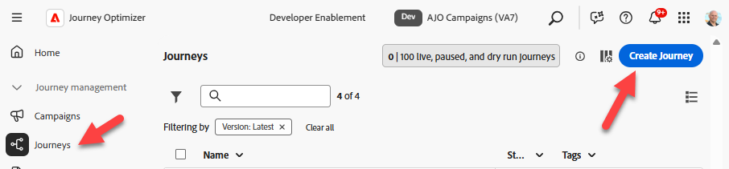
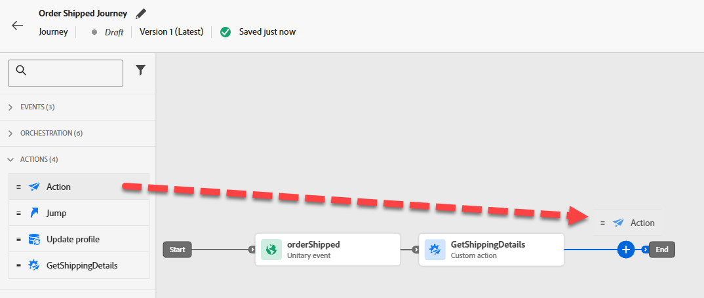
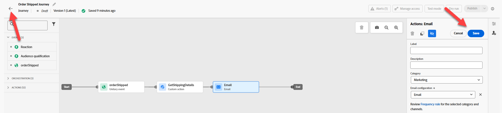

# 构建历程

## 学习目标

创建一个以配置的Order Shipped事件开始的统一历程，从外部服务获取ETA并发送电子邮件。

## 创建历程

转到&#x200B;**历程**&#x200B;并单击&#x200B;**创建历程 — 从头开始创建**




## 历程属性

1. 使用以下内容更新右边栏中的历程属性：
   - **名称**： `Order Shipped Journey`
   - **描述**： `Notify customer that order has shipped. Include shipping details.`
   - **标记**： `Default`
   - **历程指标**：*留空*

     >[!NOTE]
     >
     >**空下拉列表？**
     >
     >别担心，继续前进。 在沙盒中创建的第一个历程需要“填充泵”。  发布历程后，此下拉菜单将具有可供选择的选项。

   - **允许重新进入**： `checked`

   - **重新进入等待期：** `5 minutes`

   - **访问标签**： *留空*

   - **时区**： `Your Local timezone`

   - **在等待和条件中使用配置文件时区**： `NOT checked`

   - **开始/结束日期**： *留空*

   - **超时或错误**： `30`

   - **上限规则：** *留空*

   - **优先级**： `0`


2. 如果一切正常，请单击&#x200B;**保存**&#x200B;按钮

历程属性面板的


## 历程画布

### 添加单一事件

从&#x200B;**事件菜单**&#x200B;下的左窗格，将&#x200B;**orderShipped**&#x200B;事件拖放到画布上，如下所示


### 添加自定义操作

1. 如果左窗格展开&#x200B;**操作菜单**，然后将&#39;n拖放到画布上，则在orderShipped事件后生成名为&#x200B;**GetShippingDetails**&#x200B;的操作


2. 在右边栏中的访问和隐私配置 — >营销操作下拉列表下，确保将该值设置为&#x200B;**无**


3. 在“端点配置” — >“查询参数”菜单下，单击orderid旁边的&#x200B;**铅笔图标**


4. 在出现的模式窗口中，展开&#x200B;**Context** -> **orderShipped** -> **Order**，然后选择&#x200B;**Order ID (orderID)**&#x200B;并单击&#x200B;**确定**


5. 返回右边栏，确保“超时”或“错误”的选项为&#x200B;**取消选中**，然后单击&#x200B;**保存按钮**

取消选中


### 添加电子邮件操作

1. 在“操作”菜单下，将“**操作**”操作拖放到画布上的GetShippingDetails操作之后



2. 为营销操作选择&#x200B;**电子邮件**，然后选择&#x200B;**添加**。


3. 在右边栏中，单击&#x200B;**配置操作**

右边栏中的

4. 将&#x200B;**电子邮件渠道配置**&#x200B;设置为`Profile-Email`，然后单击&#x200B;**编辑内容**


### 添加电子邮件正文内容

对于内容，您将保持简单。 就跟愚蠢的简单一样。

1. 将主题行更新为`Order Shipped`，然后单击&#x200B;**编辑电子邮件正文按钮**


2. 在顶部栏中，单击&#x200B;**从头开始设计**&#x200B;内容块


3. 从结构容器下的左栏将&#x200B;**1:1列**&#x200B;拖放到画布上


4. 然后在“内容”容器下，将&#x200B;**Text**&#x200B;组件拖放到您的&#x200B;**1:1列**&#x200B;中


5. 单击进入文本组件并&#x200B;**删除当前文本**，然后单击&#x200B;**添加Personalization**&#x200B;图标

删除默认文本后

6. 在左边栏中，单击&#x200B;**上下文属性**&#x200B;文件夹，然后导航到&#x200B;**Journey Orchestration** -> **操作**，并选择&#x200B;**GetShippingDetails**


7. 现在，在电子邮件的主体中&#x200B;**将以下JSON复制并粘贴到** Personalization编辑器中&#x200B;****

```json
{{profile.person.name.firstName}}, your order has shipped
ETA: 
Tracking Number: 
```

8. 按如下方式添加个性化字段（**单击左边栏**&#x200B;上的字段旁边的加号“+”）：
   - **ETA：** `eta`
   - **跟踪号：** `tracking_number`


>[!NOTE]
>
>单击&#x200B;**+符号**&#x200B;以将个性化属性从边栏添加到画布。  它会将其放在光标所在的位置，以确保您正确“对齐”

>[!NOTE]
>
>您的电子邮件将使用上下文属性（ETA和跟踪编号）和配置文件属性（名字）的组合。 如果要添加其他配置文件属性，可以单击“配置文件属性”选项卡并选择您看到的任何内容。
>
>用于添加其他配置文件属性的

9. 单击屏幕底部的&#x200B;**验证**&#x200B;按钮，并确保没有错误


10. 如果一切正常，请单击右上方的&#x200B;**保存按钮**
11. 然后，再次单击右上方的&#x200B;**保存**&#x200B;按钮，然后单击左上方的&#x200B;**\&lt; — 左箭头**


12. 最后，单击左上角的&#x200B;**\&lt;返回图标**&#x200B;以返回历程画布

左上角的

>[!TIP]
>
>然后再次单击“**上一步**”按钮……开玩笑！ 这是此节😜中的最后一个返回按钮


### 覆盖电子邮件参数

返回主历程画布上的“电子邮件”节点，确保您可以看到只读字段（您可能需要单击&#x200B;**显示只读字段**&#x200B;图标）


1. 向下滚动至&#x200B;**电子邮件参数**&#x200B;并单击&#x200B;**启用参数覆盖**&#x200B;图标

电子邮件参数下的

2. 单击空文本框，然后在左边栏中向下展开至&#x200B;**Context** -> **orderShipped** -> **\_dep**，然后单击&#x200B;**personalEmail**&#x200B;字段。  然后单击&#x200B;**确定按钮**


>[!WARNING]
>
>这样做很危险，除非您需要在生产环境中使用。  这将覆盖历程在配置文件上查找以执行消息的默认位置。


3. 单击右上方的&#x200B;**保存按钮**，然后单击左上方的&#x200B;**上箭头** \&lt; — 以&#x200B;**关闭**&#x200B;历程



## 回顾

能够响应Order Shipped事件触发器、从外部服务获取ETA并发送电子邮件的已发布历程。
