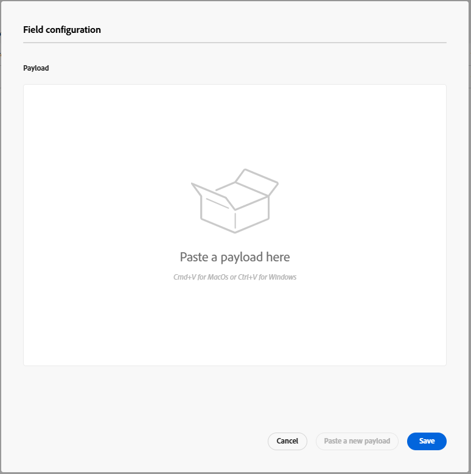
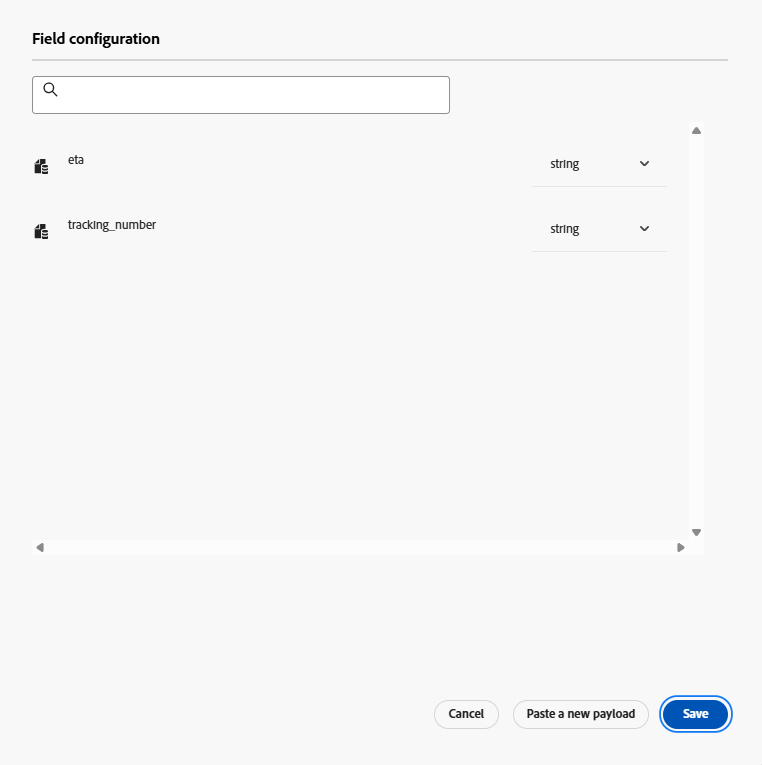
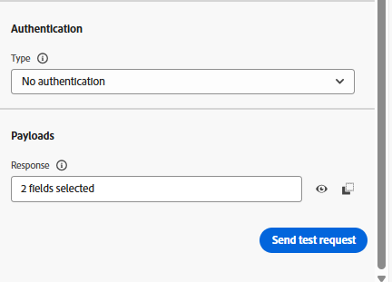

# 配置自定义操作

## 学习目标

创建一个自定义操作，定义历程与外部端点或服务通信的方式，以获取包到达时的ETA。

## 导航到操作

在左边栏中的“管理”菜单下，单击&#x200B;**配置**，然后在“操作”拼贴上单击&#x200B;**管理**&#x200B;按钮

“配置”下“操作”拼贴上的


## 配置操作

### 操作名称和详细信息

1. 在右上角单击&#x200B;**创建操作**&#x200B;按钮

   右上角的

2. 在显示的配置面板中，更新以下基本值，如下所示：
   - **名称**： `GetShippingDetails`
   - **描述**： `Call third party to get Shipping ETA and Tracking Number`
   - **操作类型**： `Custom`
   - **频道**： `Email`
   - **必需的营销操作**： `Email Targeting`


### 端点详细信息

在“端点”配置区域中，提供以下详细信息：

- **终结点URL**： `https://api.mockaroo.com/api/67077bb0?count=1&key=a0dbce20`
- **方法**： `GET`
- **标头：** *保持原样*
- **查询参数：**
  - **名称**： `orderid`
  - **类型**： `variable`

>[!NOTE]
>
>变量允许您在历程期间传入值，而不是为所有历程使用静态值

- **身份验证类型**： `No Authentication`


### 响应有效负载详细信息

现在，您需要提供示例有效负载，以便操作知道响应有效负载的外观。

1. 在“负载”区域中，单击&#x200B;**铅笔图标**&#x200B;以打开“字段配置”屏幕

   

   响应有效负载的


2. **复制并粘贴**&#x200B;以下有效负载到有效负载框中

   ```json
   {
    "eta": "11/19/2025",
    "tracking_number": "072000326"
   }
   ```

   >[!NOTE]
   >
   >这与上面的Mockaroo端点应返回的JSON结构相同：


3. 将显示响应有效负载。 单击&#x200B;**保存**&#x200B;按钮。

使用“保存”按钮显示的

>[!NOTE]
>
>您可以将所有内容保留为字符串，但在现实工作中，您可能希望更新以匹配数据类型


### 测试操作

1. 单击右下边栏中的&#x200B;**发送测试请求**&#x200B;按钮，确认配置是否正常工作

   在右下边栏中


2. 单击&#x200B;**查询参数**&#x200B;选项卡并将`orderId`的值更新为&#x200B;**123**

   的查询参数选项卡


3. 单击&#x200B;**发送按钮**，如果一切运行良好，您应该会看到响应代码200和有效负载预览，如下所示……

   发送测试请求后

   预览

   ```json
   {
     "eta": "12/26/2025",
     "tracking_number": "063112249"
   }
   ```

   >[!WARNING]
   >
   >如果您没有看到200响应或预览，请不要继续。 请咨询您的讲师以获取帮助。


4. 单击&#x200B;**取消**&#x200B;按钮以返回“操作”屏幕，然后在右上边栏中向上滚动并单击&#x200B;**保存**&#x200B;按钮

>[!SUCCESS]
>
>恭喜！ 得益于专家级别的Ctrl+C和Ctrl+V技能，您的自定义操作已上线。

## 回顾

Adobe Journey Optimizer中配置的可重用自定义操作，它获取订单ID并返回ETA和跟踪编号。
