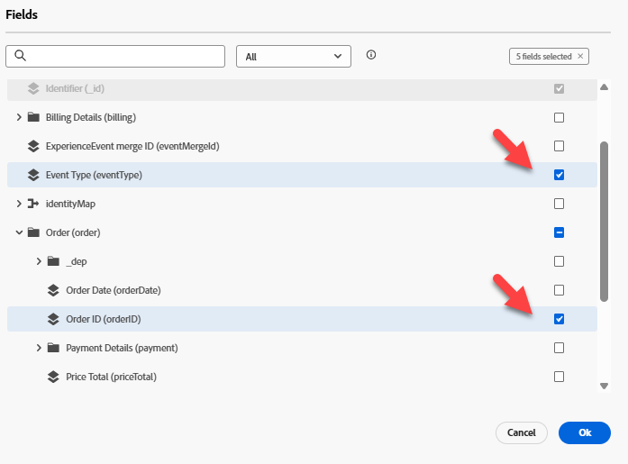
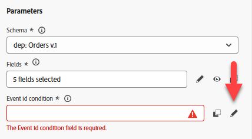

# 配置事件

## 学习目标

创建并配置将在发生采购后操作（订单已发运）时触发客户历程的事件。

## 导航到Journey Optimizer

单击浏览器右上角的&#x200B;**多维数据集**，然后选择&#x200B;**Journey Optimizer**

## 配置订单已发运事件

要创建使用单一事件的历程，我们需要首先配置该事件。

1. 在左边栏中的“管理”菜单下，单击&#x200B;**配置**，然后在“事件”拼贴上单击&#x200B;**管理**&#x200B;按钮

“配置”下的“事件”拼贴上的

2. 在右上角单击&#x200B;**创建事件**&#x200B;按钮

右上角的

3. 更新事件的设置，如下所示：
   - **名称** = `orderShipped`
   - **类型** = `Unitary`
   - **事件ID类型** = `Rule based`
   - **架构** = `dep: Orders v.1`

4. 在`Fields`输入框中，单击&#x200B;**铅笔图标**

字段输入框中的

5. 选择要添加到事件的以下字段，完成后，单击&#x200B;**确定**&#x200B;按钮
   - `Event Type (eventType)`
   - `Order ID (orderID)`

>[!NOTE]
>
>确保只选择订单ID字段，而不是订单😁中的所有字段

6. 在`Event Id condition input`中，单击&#x200B;**铅笔图标**

事件ID条件输入中的

7. **将**&#x200B;字段拖到画布上`Event Type`

8. 在出现的选择框中查找并检查标题为&#x200B;**orders.shipped.**&#x200B;的值 然后单击&#x200B;**确定**&#x200B;按钮。

9. 接下来，使用下面显示的值更新命名空间和配置文件标识符的最后两个值：
   - **命名空间** —> `Email`
   - **配置文件标识符** —> `personalEmail`

>[!NOTE]
>
>**用于的命名空间和配置文件标识符是什么？**
>
>对于使用事件的任何历程，您必须为该事件指定应使用什么身份命名空间和关联的配置文件标识符来查找配置文件。 务必要了解，选择一种身份而不是另一种身份可能会影响历程的工作方式。
>
>*快速示例：*
>
>事件有效负载是一个页面视图，其中包含如下标识：ECID（主标识）和客户ID（可选）
>
>- 选择的ECID —>这可能是身份服务第一次看到这种关系，因此当历程收到此事件时，它将尝试使用ECID查找配置文件，但无法找到配置文件。  为什么？ ECID和客户ID之间的关系尚不存在，个人资料的特征可能会根据已知的标识符客户ID进行存储
>- 所选客户ID —>无需填充此标识，且在大多数页面查看中，可能为空。  因此，如果选择此身份，则只有在设置了客户ID的经过身份验证的页面查看时，才会触发历程。
>
>简短回答：没有正确答案，只是需要根据用例😃进行权衡

## Final orderShipped事件配置

验证以下的最终事件配置是否匹配。  如果一切正常，请单击&#x200B;**保存**&#x200B;按钮

>[!TIP]
>
>您已配置您的第一个AJO事件。 自己击掌！

## 回顾

Adobe Journey Optimizer中配置为订单发送的事件，可用作历程的入口点
