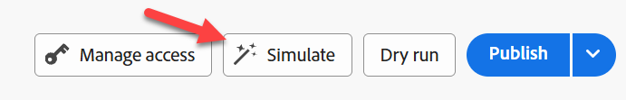
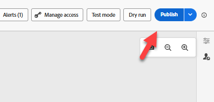

# 测试历程

## 学习目标

使用历程测试工具验证是否已正确配置事件触发器和历程逻辑。

## 测试历程

1. 在左边栏上单击&#x200B;**历程**，如果没有看到历程列表，请单击&#x200B;**浏览选项卡**
2. 单击您的&#x200B;**历程**&#x200B;以将其打开
3. 单击&#x200B;**警报**&#x200B;并确保没有错误（警告正常）

   

   >[!NOTE]
   >
   >**什么是CJMMAS - 2001-200**
   >
   >指示电子邮件变体中缺少选择退出链接

4. 单击&#x200B;**模拟**，然后在左侧选择&#x200B;**测试模式**

   在左侧的“模拟”下选择了


   >[!NOTE]
   >
   >可能需要一分钟才能准备好。 在此期间，触发器事件按钮将不可用。


5. 单击&#x200B;**触发事件**&#x200B;并填写以下属性：
   - **事件类型**： `orders.shipped`
   - **个人电子邮件**： `henry.creel@emailsim.io`
   - **订单ID**： `123`
6. 单击&#x200B;**发送**（请注意，单击发送后需要几秒钟才能做出响应）

   

   >[!WARNING]
   >
   >有些学生收到错误后需要发送此消息几次。 您可能需要多&#x200B;**次**&#x200B;执行此操作。
   >
   >**有时**&#x200B;第一次发送出错：
   >
   >**入口不存在（参考ID：3216a850-c40d-11f0-8fa5-73d1522cc9a2）**
   >
   >如果收到错误，请单击&#x200B;**触发事件**，然后重新&#x200B;**发送**。  您可能必须&#x200B;**多次**。


7. 在&#x200B;**结果** ->下，单击左侧的&#x200B;**显示日志**

触发测试事件后

>[!NOTE]
>
>某些收到错误的学生有时会收到不同的日志，其中显示空实例数组`{"instances": []}`。 这不是阻断因素，请继续下一步骤。

您应在日志中看到类似以下的内容：

>[!NOTE]
>
>我们正在查找使用的关键字段：**actionsHistory**、**transitionsHistory**、**eta**、**tracking_number**、**eventType**、**personalEmail**&#x200B;和&#x200B;**orderID**。

```json
{
  "actionsHistory": {
    "8919055f-1b00-4a43-8bd6-c8af894474b2": {
      "eta": "11/27/2025",
      "tracking_number": "091204404",
      "jo_status_code": "http_200"
    }
  },
  "transitionsHistory": {
    "orderShipped (1158856989)": {
      "eventType": "orders.shipped",
      "_id": "joTestModeEvent_5abbfdcd-561d-45a7-ba42-d0640539831a",
      "_dep": {
        "personalEmail": "henry.creel@emailsim.io"
      },
      "order": {
        "orderID": "123"
      },
      "timestamp": "2025-11-17T23:30:49.576289372Z"
    }
  }
}
```


1. **关闭**&#x200B;浏览器&#x200B;**选项卡**
1. 右上角的&#x200B;**关闭测试模式**

   右上角的

1. 单击右上方的&#x200B;**发布**&#x200B;历程

   右上角的历程的

1. 单击左上角的\&lt; — 箭头&#x200B;**关闭****历程**


接下来，我们将向AEP发送一个真正的订单已发运事件

## 回顾

历程已通过配置验证，可以接收事件
