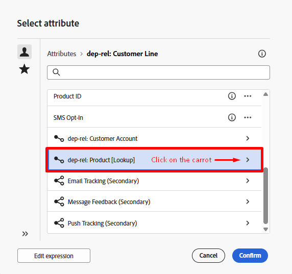
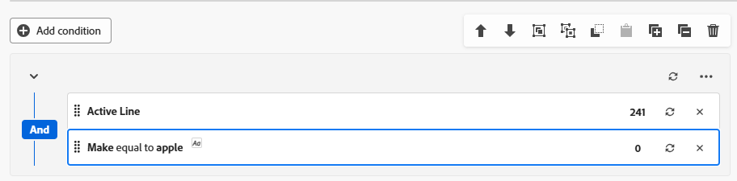

# 构建受众

## 目标

在接下来的几个步骤中，您将创建要为该营销活动定位的受众，该受众是所有活跃的线路持有者，他们的品牌与正在启动的旗舰手机相匹配。  目标是您要通过短信消息定向的用户组，督促他们升级手机。

## 添加构建受众活动

1. 在画布上单击&#x200B;**+符号**，然后选择&#x200B;**构建受众**&#x200B;活动以将其添加到工作流

2. 在右边栏中，您可以看到构建受众属性。 更新标签以声明以下内容： `Active Lines with Apple`

使用Apple将

## 选择定位维度

下一步是选择&#x200B;**定向维度**（即您要查询的表）。 执行以下步骤：

1. 单击“定位”维度框中的&#x200B;**搜索图标**

“定位”维度框中的

2. 在弹出窗口中，搜索并选择名为&#x200B;**dep-rel：客户行**&#x200B;的表，然后单击&#x200B;**确认**&#x200B;按钮。

>[!NOTE]
>
>始终记住您创建的每个受众的&#x200B;**定向维度**。 您将在后续步骤中了解其重要性。

>[!NOTE]
>
>如果您选择Adobe创建的架构，请注意，该架构以 — > *(caas)*&#x200B;开头。 这只是一个应用于关系存储中的表的命名空间，表示Campaign as a Service ：)

## 创建受众

现在，您已选择定向维度（要查询的关系架构），可以开始创建定义了。

1. 在右边栏中，单击&#x200B;**创建受众**&#x200B;按钮

右边栏中的

2. 下一步单击&#x200B;**添加条件**&#x200B;按钮

## 创建条件

现在，可以使用架构中的属性来编写受众的逻辑。 目标是找到所有处于活动状态并使用Apple开发的客户行。

### 创建条件#1

1. 使用以下信息设置条件：
   - **属性**： `Active Line`
   - **值**： `true`

2. 单击&#x200B;**刷新**&#x200B;图标以查看条件的合格计数。

的合格计数为241

>[!TIP]
>
>如果您已正确构建条件，则会看到241的结果

### 创建条件#2

1. 单击&#x200B;**添加条件**&#x200B;按钮，然后单击&#x200B;**>**&#x200B;图标以选择&#x200B;**dep-rel：** **Product \[Lookup]**&#x200B;架构

选择dep-rel：产品[查找]架构

2. 查找名为&#x200B;**Make**&#x200B;的字段并单击三个点并选择&#x200B;**值分布**

Make字段的

3. 请注意各种值。 您只想要`Apple`，幸好它没有100个不同的拼写。 单击&#x200B;**Apple字段**&#x200B;以将其选定，然后单击右上角的&#x200B;**选择属性和值按钮**。

使用“选择属性和值”按钮选择的

>[!NOTE]
>
>这是数据架构师应该使用枚举来设计架构的主要示例。  这样，营销人员就不必手动选择/键入值。  数据架构师的耻辱！

4. `Make`字段连同下面显示的条件一起自动添加。
   - **运算符：** `Equal to`
   - **值：** `Apple`
   - **区分大小写：** `Enabled`

5. 单击&#x200B;**计算图标**，结果为85。

>[!NOTE]
>
>请注意组中是否使用了AND运算符。 无论是在显示这样的单个组中还是在多个组中进行构建，AND函数都非常重要，因为它会告知编排的营销活动两个条件都必须为true。

## 验证计数

1. 单击在标题下的右边栏中找到的&#x200B;**计算图标**（目标配置文件）以获取受众规模的准确估计值。 您将&#x200B;**65**&#x200B;视为&#x200B;**最终计数**。

>[!NOTE]
>
>请注意每个单独条件如何返回不同的数字（条件#1 —> 241和条件#2 —> 85），但最终受众规模是两个条件中较小的。  这是因为AND运算符。

2. 如果您看到&#x200B;**65**&#x200B;的最终计数，请单击屏幕右上方的&#x200B;**确认**&#x200B;按钮，然后单击右上方的&#x200B;**保存**&#x200B;按钮以保存您所做的工作。

## 挑战

假定您键入了最后一个条件，使`Make`等于`apple`（小写），并且您已将`Case sensitive`的配置选项保留为“已切换`on`”。  这将使条件记录数等于0。  所以你有241条活跃的线路和0条苹果是制造出来的。

**在这种情况下，最终受众规模将是多少？**

## 回答

是零。 你知道为什么吗？

## 回顾

您已成功创建第一个受众，现在应该会看到在构建受众活动中开发和验证计数有多么容易。

回顾之后
