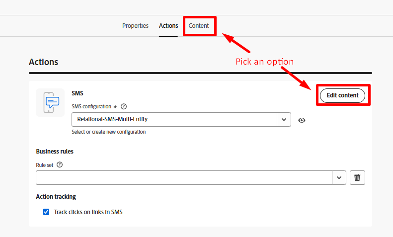
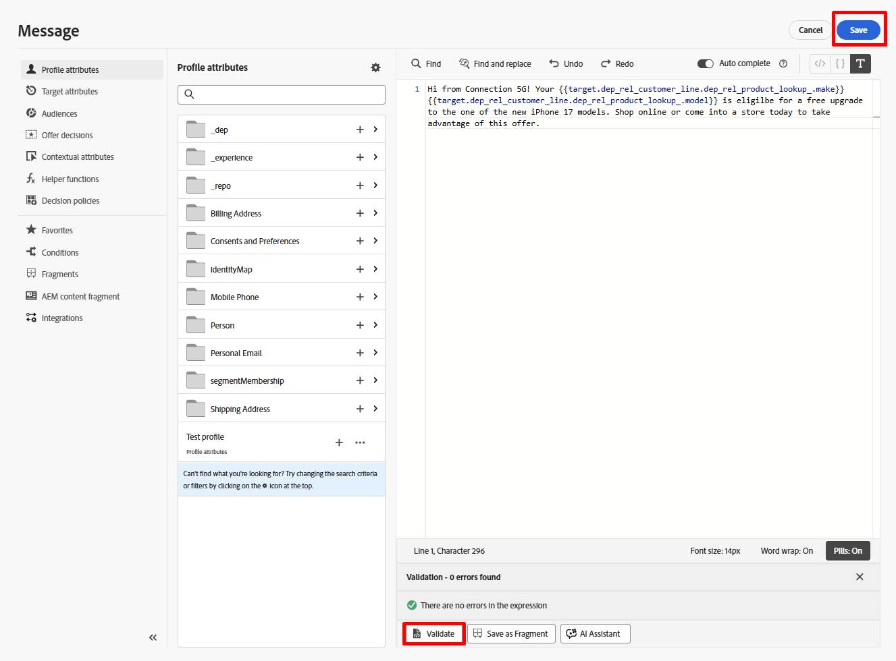
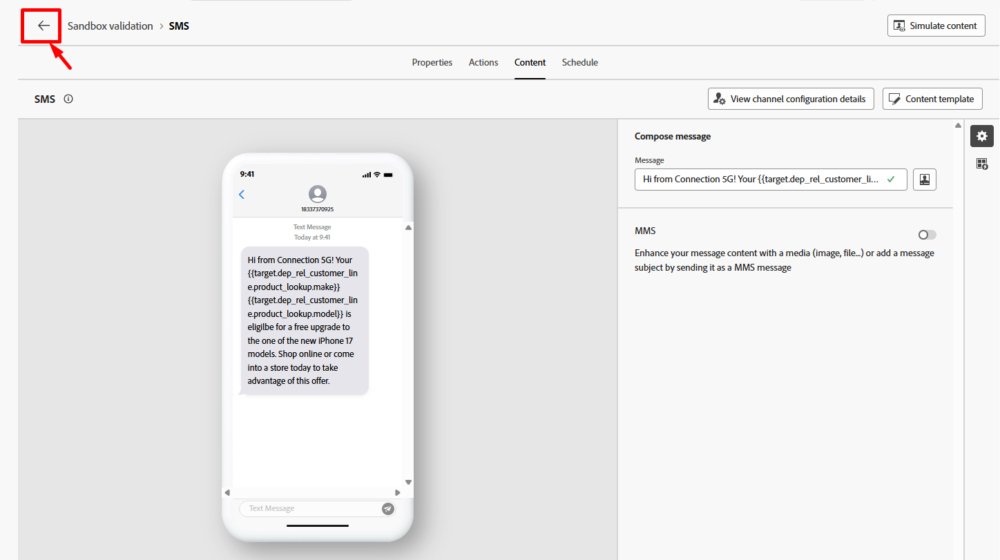

# 撰写短信

## 目标

在接下来的几个步骤中，您将编写一条非常简单的短信消息。  您将看到如何轻松地在极其基本的级别添加某些内容，并根据关系存储中的数据将消息个性化。


## 导航到内容

单击&#x200B;**编辑内容**&#x200B;按钮，或直接导航到&#x200B;**内容**&#x200B;选项卡




## 创建消息

1. 单击&#x200B;**Personalization**&#x200B;按钮以创建您的消息。


>[!NOTE]
>
>“魔棒”选项使用人工智能帮助您编写消息。 如果你愿意，可以试试看，但我们不会在本实验室进行报道。


&#x200B;2. 将下面的文本复制并粘贴到短信消息正文中。

```none
Hi from Connection 5G! Your phone_make phone_model is eligible for a free upgrade to one of the new iPhone 17 models. Shop online or come into a store today to take advantage of this offer.
```

>[!NOTE]
>
>请确保在消息编辑器中将自动换行更改为&#x200B;**打开**。  您可以在窗口的右下窗格中找到。


&#x200B;3. 使用左边栏中的&#x200B;**Target属性**&#x200B;选项，更新下面名为&#x200B;**phone\_make**&#x200B;和&#x200B;**phone\_model**&#x200B;的消息中的两个字段。  完成后，您的消息应与屏幕快照匹配。


>[!NOTE]
>
>你为什么要这样做？  您想要使用客户手机代号和型号将消息个性化，并且此信息位于关系商店的Customer Line表中。  这演示了如何使用编排的营销活动中的数据来个性化消息。


&#x200B;4. 单击编辑器上的&#x200B;**验证**，确保没有验证错误，如果成功，请单击&#x200B;**保存**&#x200B;按钮




&#x200B;5. 完成返回到工作流画布后，单击&#x200B;**后退箭头(\&lt;-)**




## 回顾

您刚刚创建了一条消息，希望现在对消息编辑器的工作方式有了更多的了解。  请记住，您可以使用关系存储中的数据对其进行个性化，也可以使用实时客户资料中的数据对其进行个性化设置！

>[!NOTE]
>
>如果您使用实时客户配置文件属性在编排的营销活动中个性化消息，只要记住从数据湖中的配置文件快照数据集提取消息即可，因此属性的存在时间最长可达24小时。 配置文件快照仅在每日批处理分段作业后每天更新一次。
