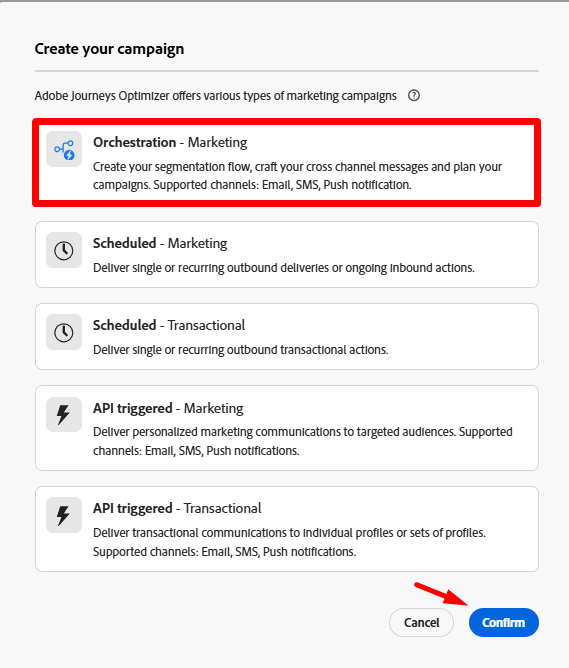
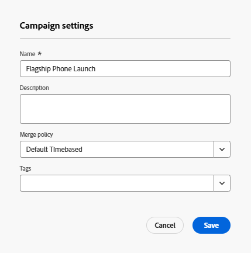

# 创建编排的营销活动

## 目标

在接下来的步骤中，您将创建作为任何促销活动起点的编排促销活动（无活动）的外壳。

## 导航到营销活动

1. 首先，通过从浏览器右上角的应用程序抽屉中选择应用程序，确保您位于Adobe Journey Optimizer应用程序中

2. 在左侧导航边栏中，选择&#x200B;**营销活动**
3. 然后单击右上角的按钮&#x200B;**创建营销活动**

在营销活动导航中

4. 在显示的模式窗口中，选择&#x200B;**Orchestration - Marketing**&#x200B;并单击&#x200B;**Confirm**

## Campaign设置

1. 使用以下信息填写所需的营销活动元数据：
   - **名称** —> `Flagship Phone Launch`
   - **描述** —> *留空*
   - **合并策略** —> `Default Timebased`
   - **标记** —> *留空*

完成后，您的屏幕应如下所示。

2. 单击&#x200B;**保存**&#x200B;按钮继续。

## 了解计划

在创建营销活动后，您应该立即进入工作流画布。  请注意，右上角有一个计划选项，用于选择此工作流应针对您的营销活动运行的频率。

默认值始终设置为&#x200B;**尽快**。 在本练习中，我们将使用默认设置，但您有许多其他选项。

## 回顾

您现在已经了解了如何创建编排的营销活动以及在安排时间方面可供您使用的常规选项。
