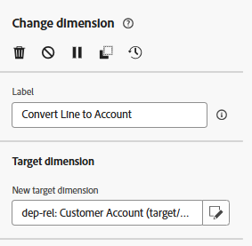

# 筛选行

## 目标

在接下来的步骤中，您将过滤掉实际上不允许使用短信消息定向的所有行，因为这些行在行级别被禁用。  在此不能依赖配置文件同意，因为这是行级目标。

## 设置拆分活动

1. 单击“分支”活动底部过渡处的&#x200B;**+**&#x200B;图标，然后在弹出窗口中选择&#x200B;**Split**&#x200B;活动。

&#x200B;2. 在右边栏中，更新标签以声明以下内容： `Filter out opt'd out lines`

&#x200B;3. 在右边栏中，展开默认区段&#x200B;**子集**&#x200B;部分，然后单击&#x200B;**创建过滤器**&#x200B;按钮

&#x200B;4. 添加条件以确保您删除所有选择禁用短信消息的客户行，然后单击&#x200B;**确认**。

>[!NOTE]
>
>您需要了解如何创建条件，但最终结果与上面的屏幕快照匹配。  你搞定了！

&#x200B;5. 单击右上角的“保存”按钮以保存您所做的工作。  你的画布现在看起来好像\...

保存拆分活动后

## 添加短信活动

1. 在工作流画布上，单击添加的分割条件后面的&#x200B;**+**&#x200B;图标，然后选择&#x200B;**短信活动**

&#x200B;2. 在右边栏中，单击编辑短信按钮以开始配置短信消息

在右边栏中

&#x200B;3. 在顶部导航中，单击操作菜单项，然后从短信配置下拉列表中选择您之前创建的渠道。

>[!CAUTION]
>
>哦，不🫨！  为什么没有结果？  您尚未设置短信渠道吗？  产品是否损坏？
>
>吓坏了!!!!!!!!!

## 惊慌时刻

分支的过渡当前具有客户行的定向维度（即，当前结果在关系存储中与什么表相关）。  不过，编排的营销活动的独特之处在于，在发送时，您始终会返回到Real-time Customer Profile，这样消息中的投放和跟踪信息就会被归因于某个用户档案。  Customer Account表中已为您预先构建了此连接。

短信的渠道配置是预先为您设置的，目前看起来是……

**阅读方式如下：**

- 针对在辅助维度（即客户行）中找到的相关记录数，为每个目标维度（即客户帐户）投放一条消息
- 使用在次要维度（即客户线路）中找到的手机号码执行每次短信投放

这种将许多消息发送到一个用户档案的独特功能是编排营销活动的主要功能之一，使其与历程有所不同。

那么你怎样才能让这个运作起来呢？  添加更改维度😀

## 添加更改维度

1. 单击短信编辑屏幕上的返回按钮

&#x200B;2. 在工作流画布上，单击筛选器和短信活动之间的&#x200B;**+** **图标**，然后选择&#x200B;**更改维度**。

&#x200B;3. 在右侧，使用下列信息更新变更维度：
   - **标签：** `Convert Line to Account`
   - **新目标维度：**`dep-rel: Customer Account`

&#x200B;4. 单击画布右上角的&#x200B;**保存**&#x200B;按钮以保存您所做的工作。 完成后，您的工作流现在将如下所示……

添加更改维度后

## 短信消息配置

现在您已修复工作流，请重新配置短信。

1. 单击工作流画布中的短信活动，然后在左边栏中，单击&#x200B;**编辑短信**&#x200B;按钮

>[!NOTE]
>
>加载此屏幕需要一点时间。  我知道这很烦人，相信我，它会被修复的

&#x200B;2. 在顶部导航中，单击&#x200B;**操作**&#x200B;菜单项，然后从短信配置下拉列表中选择您之前创建的渠道。

>[!TIP]
>
>感觉很好，不是吗😮‍💨

## 回顾

你通过这次学习成功了，并满怀希望地学会了两个非常重要的东西：

1. 最终结果定位维度必须与要使用的渠道配置匹配
1. 更改维度活动可能会成为您确保实现此目标的最佳朋友
