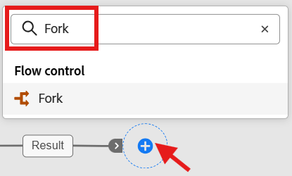
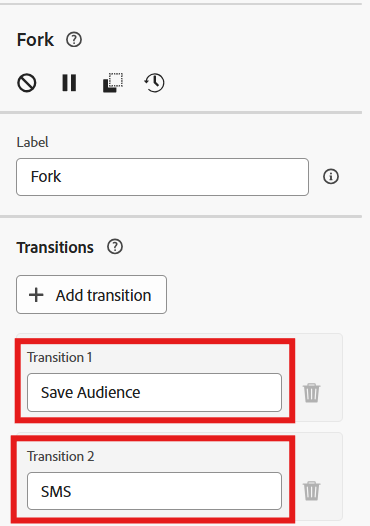

# 创建结果分支

## 目标

此步骤非常简单，因为您只需添加一个分支活动，以便您可以复制结果，并在后续步骤中对其执行两项不同的操作：

1. 保存受众以供其他人用于广告或跨渠道目的
1. 向各行发送短信消息。

## 创建分支

1. 在工作流画布上，在生成受众活动后单击&#x200B;**+** **图标**，然后选择&#x200B;**分支活动**

   

2. 通过单击过渡并指定名称（如下所述），更新分支中每个过渡的名称：
   - **前** —> `Save Audience`
   - **底部** —> `SMS`

   

   完成后，您的画布现在看起来应该像这样……

   添加分支活动后

   >[!NOTE]
   >
   >实际上，分支活动只是将上一个活动的结果复制到两个独立的分支中

3. 单击工作流画布顶部的&#x200B;**保存**。

工作流画布工具栏上的

>[!TIP]
>
>那很难，不是吗😁

## 回顾

请注意，您创建了结果的分支（即复制结果），这允许您明确指示分支处理保存受众，而另一个分支可用于短信发送。

>[!NOTE]
>
>特别是当您计划将受众另存为保存受众活动不允许活动关注时，您需要使用Forks。
