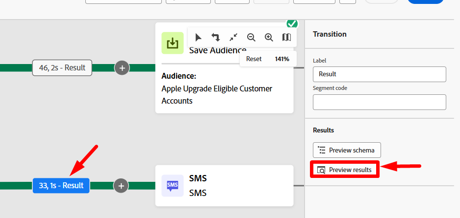

# 运行工作流

## 目标

在接下来的几个步骤中，您将了解如何使用测试模式测试工作流程，以及更重要的，使用测试模式测试短信活动。

## 验证工作流

1. 完成后，最终工作流将类似于以下内容。 仔细检查一切看起来正常。 您会看到：

2. 如果您尚未停止工作流，请确保您现在通过单击右上角的&#x200B;**停止**&#x200B;按钮来停止工作流。

工作流右上角的

>[!NOTE]
>
>或者，您也可以尝试单击“重新启动”按钮，但您可能会看到错误，因为您在创建工作流后添加了活动，并且工作流缓存不再有效。

3. 接下来，单击&#x200B;**开始**&#x200B;按钮以端到端地执行和测试工作流

4. 通过单击&#x200B;**结果**（由于有两个结果，因此请使用下面所示的左边栏中的结果），然后在左边栏中单击&#x200B;**预览结果**&#x200B;按钮，查看进入短信活动的结果。

右边栏中的

5. 您看到了&#x200B;**33条记录**，并且定向维度与客户ID（如果要进行配置，为联接键）匹配

匹配

## 测试短信活动

1. 关闭上一个窗口并单击&#x200B;**短信活动**，然后单击右边栏中的&#x200B;**运行测试**&#x200B;按钮

2. 几乎立即会出现一个标记为&#x200B;**查看报告**&#x200B;的新按钮。  单击&#x200B;**查看报表**&#x200B;按钮以启动到报表屏幕中。

>[!NOTE]
>
>此屏幕最初不会填充，因为执行测试运行需要一些时间。 您可能需要刷新几次才能看到结果。

3. 当您获得结果时，您会看到100%被定向！

*等待，一分钟……传入的结果是33条记录，那么4条记录指向何处？*

4. 返回工作流画布并单击进入短信活动的过渡&#x200B;**结果**，然后单击右边栏中的&#x200B;**预览结果**。

5. 在预览结果屏幕中一直滚动到表的底部，您注意到&#x200B;**4记录**&#x200B;具有&#x200B;**空白的定向维度**。

表](assets/run-the-workflow-4-records-missing-dimension.png)底部具有空白定向维度的![4条记录

## 说明

所以事情是这样的。

- 您有33条客户线路希望发送短信消息
- 在更改维度活动4之后，这些客户行没有关联的客户帐户
- 加入Real-time Customer Profile要求您具有客户ID，由于这4条记录中没有任何一个，因此无法动态查找用户档案或创建新用户档案

结果 — >编排的营销活动在消息执行中丢弃这4条记录

>[!NOTE]
>
>有一项增强功能将通过两种方式帮助解决此问题：
>
>1. 确保为发送时缺少定向维度的记录创建排除日志
>2. 更新更改维度活动以执行内部连接与外部连接，这将预先删除这4条记录

>[!TIP]
>
>恭喜！ 现在，您已获得正式认证，可以推出自己的精心策划的促销活动，并向全世界广播消息 — 我们希望这是负责任的。 像一个宏伟的数字巫师一样去推销自己！

## 发布工作流

在实验中，您不会这样做，但具体内容如下：

1. 如果活动设置了计划，则调度程序将启动
1. 保存受众活动会在受众门户中创建受众Shell，并且符合条件的配置文件会开始摄取
1. 将从工作流中的第一个消息活动开始执行消息
   - 对配置文件快照进行配置文件查找
     - 匹配的用户档案遵循在用户档案上找到的同意
     - 随即创建不匹配的配置文件
   - 在`AJO Message Feedback Event Dataset`中创建投放日志
