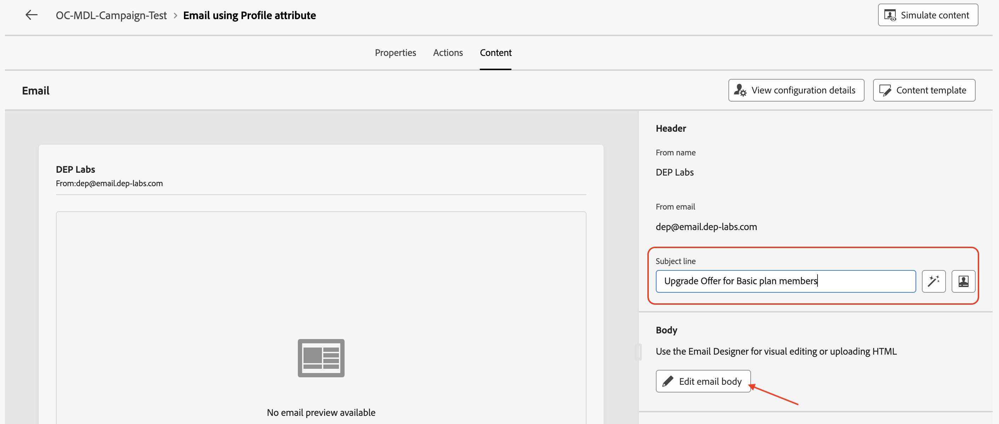

# 添加电子邮件活动

## 目标

在接下来的几步中，您将基于此营销活动添加两个电子邮件活动，以将其添加到两个分支活动。 您将配置两个电子邮件活动以使用之前创建的电子邮件渠道。 最后，您还要将基本电子邮件设置（主题和正文）添加到每个电子邮件活动中。

>[!CAUTION]
>
>在继续之前，您必须确保两个电子邮件渠道配置在其状态中都显示为活动。
>
>

## 添加顶级分支电子邮件活动

1. 单击顶部流的&#x200B;**+**，然后从&#x200B;**渠道活动**&#x200B;中选择&#x200B;**电子邮件**

**电子邮件**&#x200B;详细信息窗格打开

2. 使用&#x200B;**电子邮件**&#x200B;活动的配置文件属性&#x200B;**将标签重命名为**&#x200B;电子邮件，然后单击&#x200B;**编辑电子邮件**。 请注意，创建电子邮件正文仅用于测试目的

3. 选择&#x200B;**操作**&#x200B;选项卡，然后从下拉列表中选择&#x200B;**Profile-Email**&#x200B;渠道配置

4. 接下来，单击&#x200B;**编辑内容**&#x200B;以添加一些测试内容

5. 提供&#x200B;**主题行** （“基本计划成员的升级选件”），然后单击&#x200B;**编辑电子邮件正文**&#x200B;按钮

6. 有许多选项，对于此测试，请选择&#x200B;**自己编写代码** HTML选项

7. 在&#x200B;**电子邮件Designer**&#x200B;中，插入一行“有可用的升级选件！” 在所示的`</body></html>`标记之前单击&#x200B;**保存**

8. 等待右下角显示确认消息

9. 单击&#x200B;**电子邮件Designer**&#x200B;旁边的&#x200B;**向左箭头**&#x200B;退出

10. 此时会弹出一个确认对话框，请单击&#x200B;**保存并关闭**&#x200B;按钮

11. 查看电子邮件属性和操作，包括添加到电子邮件正文的文本。 单击&#x200B;**向左箭头**&#x200B;以导航回促销活动画布

## 添加底部分支电子邮件活动

返回促销活动画布，单击底部流的&#x200B;**+**，然后从&#x200B;**渠道活动**&#x200B;中选择&#x200B;**电子邮件**。 执行与上述相同的步骤（步骤2至11），以下步骤除外：

- 为&#x200B;**电子邮件**&#x200B;活动使用Target Dimension **将标签重命名为**&#x200B;电子邮件
- 在“电子邮件”设置中，选择&#x200B;**关系电子邮件**&#x200B;电子邮件渠道配置

## 回顾

您现在已了解如何使用电子邮件渠道配置电子邮件活动。 然后，为每个活动配置了非常基本的电子邮件主题和正文。 接下来将测试整个营销活动。
