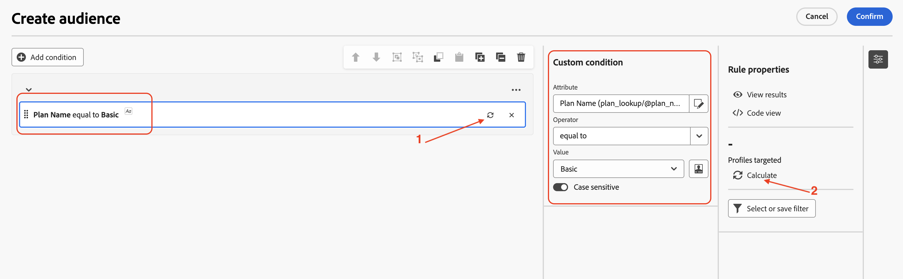
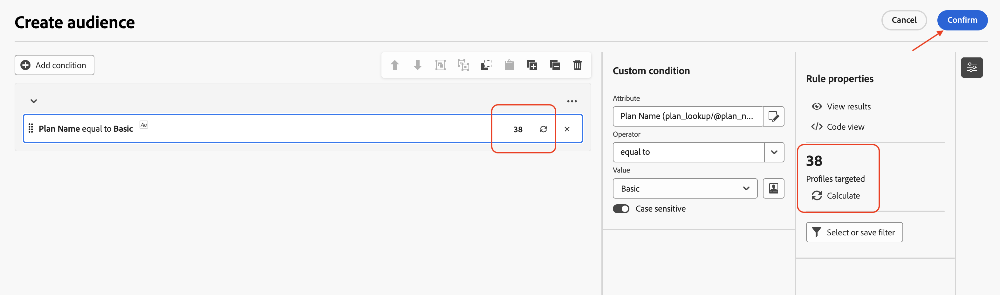

# 构建受众

## 目标

在接下来的几步中，您将通过选择正确的定向维度并设置适当的条件，从关系架构构建受众。 您还将使用刷新选项检查预期的行数。

## 生成受众

1. 呈现营销活动后，单击画布中的&#x200B;**+**&#x200B;以打开选项菜单，然后从&#x200B;**定位活动**&#x200B;中选择&#x200B;**构建受众**

   

2. **构建受众**&#x200B;活动在右侧打开详细信息窗格，单击“搜索”图标以选择&#x200B;**定向维度**。

   

3. 从列表中选择`dep-rel: Customer Account`并单击&#x200B;**确认**

   

4. 配置&#x200B;**定向维度**&#x200B;后，单击“创建受众”以开始从关系架构构建受众的过程

   

5. 创建受众详细信息窗格打开，单击&#x200B;**添加条件**

   

6. 通过单击旁边的&#x200B;**>**&#x200B;向下滚动并展开`dep-rel: Plan Lookup`

   

7. 选择`dep-rel: Plan Name`并单击&#x200B;**确认**

   

8. 在“自定义条件”面板中，将运算符保留为“等于”，对于“值”，请从下拉菜单中选择“基本”。

   计划名称等于Basic的

   >[!NOTE]
   >
   >请注意，所有可用于选定列的不同值都会显示在下拉列表中，从而便于创建自定义条件。

9. 配置自定义条件后，单击刷新图标以计算和查看计数。 有两个位置可帮助计算结果

   

   >[!NOTE]
   >
   >刷新操作根据关系数据评估条件并显示预期结果。 此操作通常只需要几秒钟，对于微调标准和确保满足期望非常有用。

10. 计数(**38**)指示关系存储中与指定条件匹配的行数。 单击&#x200B;**确认**&#x200B;退出&#x200B;**创建受众**&#x200B;窗格

>[!NOTE]
>
>“规则属性”部分下有选项可获取更多详细信息。 单击&#x200B;**查看结果**&#x200B;以查看返回的实际结果。 使用&#x200B;**代码视图**&#x200B;选项查看正在执行的查询。

## 回顾

现在，您已经了解在营销策划中使用构建受众活动的难易程度，只需从关系架构中选择正确的定向维度即可。 然后，您添加了一个条件来优化受众构建标准，并使用刷新选项来检查预期的行数。

如有需要，您可以在[此处](https://experienceleague.adobe.com/en/docs/journey-optimizer/using/campaigns/orchestrated-campaigns/design-campaigns/build-audience)阅读更多内容。
