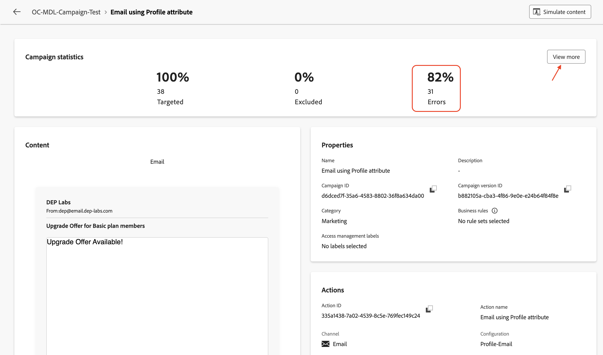

# 测试活动

## 目标

在接下来的几步中，您将在测试模式下运行营销活动，以在发布营销活动之前确认营销活动可按预期运行。 在这种情况下，测试模式不会实际发送电子邮件，但有助于验证整个流量并提前识别问题。

## 启动工作流

1. 配置两个电子邮件流后，Campaign将如下所示。 单击&#x200B;**开始**&#x200B;按钮以在&#x200B;**测试模式**&#x200B;下运行营销活动

>[!NOTE]
>
>如上一个实验室中所述，测试模式允许您验证活动执行和各种活动的结果。 每个活动都按顺序执行，直到到达流量结尾为止。

2. 此时将开始执行所有营销活动，并验证结果

## 通过电子邮件发送报表#1

1. 要测试电子邮件投放，请单击&#x200B;**使用配置文件属性**&#x200B;的电子邮件，在右窗格中单击&#x200B;**运行测试**

2. 等待确认消息，然后单击&#x200B;**查看报告**&#x200B;以查看电子邮件测试的详细信息

3. 电子邮件报告页面会显示营销活动统计数据和执行状态。 电子邮件测试是对活动的验证，以确保没有错误并且不会发送电子邮件。 通常需要大约\~**5**&#x200B;分钟才能完成。

带有营销活动统计数据的

>[!NOTE]
>
>您可能需要刷新页面几次才能看到最终测试结果。

4. 电子邮件测试完成后，将显示结果。 存在一定比例的错误；单击&#x200B;**查看更多**&#x200B;以了解原因。

查看更多链接时出现

5. 原因状态为`Email address not found in profile`

中找不到电子邮件地址

>[!NOTE]
>
>由于为电子邮件活动&#x200B;**电子邮件（使用配置文件属性**）配置的&#x200B;**投放地址**&#x200B;配置为使用配置文件属性`personalEmail.address`，因此该地址创建了对&#x200B;**AEP配置文件**&#x200B;的依赖关系。
>
>在关系架构中的&#x200B;**38**&#x200B;个符合条件的客户ID中，系统只能找到&#x200B;**7**&#x200B;个对应的AEP配置文件。 对于其余的&#x200B;**31**，AEP配置文件不存在，从而导致出现`Email address not found in profile`错误消息。
>
>请务必记住，在编排的营销活动中使用AEP配置文件属性时，datalake和关系存储中的数据保持&#x200B;**一致**。

## 通过电子邮件发送报表#2

1. 使用Target Dimension **活动对**&#x200B;电子邮件重复相同的过程

2. 等待确认消息，然后单击&#x200B;**查看报告**&#x200B;以查看电子邮件测试的详细信息

3. 电子邮件测试完成后，将显示结果。 在这种情况下，将不会出现错误

>[!NOTE]
>
>由于使用Target Dimension **的电子邮件活动**&#x200B;电子邮件的&#x200B;**投放地址**&#x200B;配置为使用关系架构中的`dep_rel_customer_account.email`，因此不依赖于AEP配置文件或其属性。
>
>在关系存储中找到所有&#x200B;**38**&#x200B;个符合条件的客户ID都有相应的电子邮件，可以成功定位，并且不会出现任何错误。

## 停止工作流

单击&#x200B;**停止**&#x200B;按钮以停止营销活动的&#x200B;**测试模式**

>[!TIP]
>
>在同一营销活动中测试了这两种电子邮件渠道配置，并观察到了使用AEP配置文件属性与在电子邮件渠道配置中使用Target Dimension之间的差异。
>
>恭喜，邮件投放实验室到此结束。

## 回顾

您现在已了解如何测试创建的营销活动以了解流量和行为。 在测试流执行期间，可以很好地理解为电子邮件渠道配置使用不同设置的细微差别。

如果您有兴趣，可以在[此处](https://experienceleague.adobe.com/en/docs/journey-optimizer/using/campaigns/orchestrated-campaigns/launch/start-monitor-campaigns)阅读有关营销活动测试模式的更多信息。
