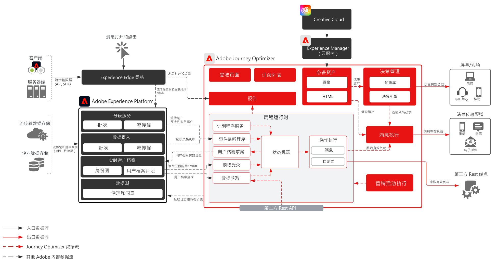
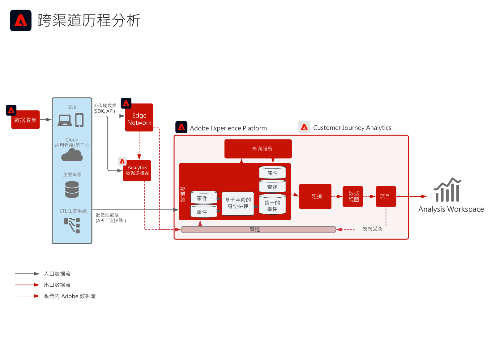

# 数字体验 Blueprint

数字体验 Blueprint 是可重复实施的产品，可让您有效应对战略和快速解决既定业务问题。每个 Blueprint 均会提供一系列工件，用于解释高价值业务问题、体系架构、实施步骤、技术注意事项以及指向相关文档的链接。

## 新增功能

* **[受众和用户档案激活到企业目标 Blueprint](/help/blueprints/audience-activation/enterprise-destinations.md)**

   *使所有系统中的客户档案保持最新，以增强您的销售和支持团队的能力。*
* **[客户活动中心 Blueprint](/help/blueprints/audience-activation/customer-activity.md)**

   *提供座席协助支持和销售的背景信息。*
* **[数据分析和智能 Blueprint](/help/blueprints/data-insights/analysis.md)**

   *对数据湖中的数据执行探索性查询和分析。*

## 特色 Blueprint

<table style="table-layout:fixed">
<tr>
  <td>
    
    
<a href="https://experienceleague.adobe.com/docs/blueprints-learn/architecture/customer-journeys/journey-optimizer.html"><strong>跨渠道编排</strong></a>

    
<em>使用[!UICONTROL Platform]作为中心，实时发送消息并影响客户体验。</em>

  </td>
  <td>
    
    
<a href="https://experienceleague.adobe.com/docs/blueprints-learn/architecture/audience-activation/known.html"><strong>线上/线下受众激活</strong></a>

    
<em>投放受众激活的跨渠道广告。</em>

  </td>
  <td>
    
    
<a href="https://experienceleague.adobe.com/docs/analytics-platform/using/cja-usecases/cross-channel.html?lang=en"><strong>跨渠道历程分析</strong></a>

    
<em>对不同渠道客户行为有一个单一整合视图。</em>

  </td>
</tr>
</table>

## 博客帖子

* [[!DNL Introducing Adobe Experience Platform’s New Digital Experience Blueprints]](https://medium.com/adobetech/introducing-adobe-experience-platforms-new-digital-experience-blueprints-93a6b5f5da7c)
* [[!DNL Blueprint for Audience Activation in Adobe Experience Platform]](https://medium.com/adobetech/a-blueprint-for-audience-activation-in-adobe-experience-platform-b2b30fae90fd)
* [[!DNL Blueprint for Web/Mobile Personalization using Adobe Experience Platform Real-Time Customer Profile]](https://medium.com/adobetech/blueprint-for-web-personalization-using-adobe-experience-platform-real-time-customer-profile-fef2ce7a4b2f)
* [[!DNL Blueprint for Cross-Channel Orchestration in Adobe Experience Platform]](https://medium.com/adobetech/blueprint-for-multi-channel-orchestration-in-adobe-experience-platform-c68317e94184)
