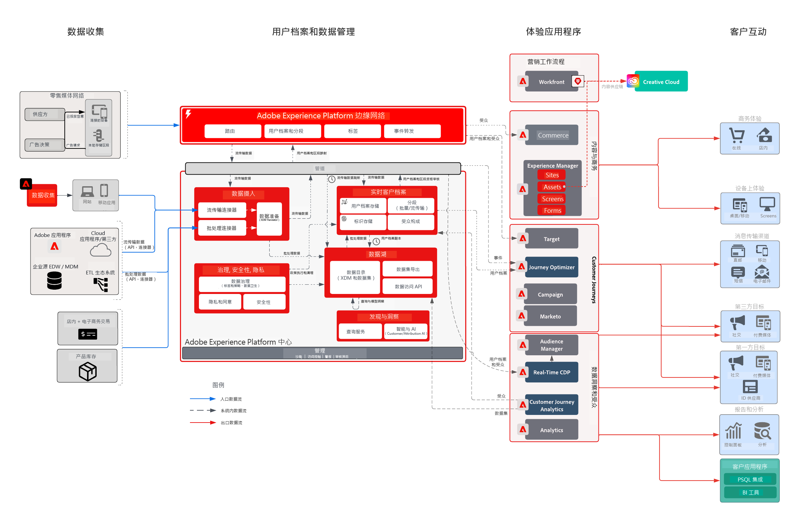

# 零售行业业务挑战

综合体验业务旨在个性化整个客户历程，以提高忠诚度、向现有客户追加销售，并优化整个营销活动的营销支出。实现目标的战略是扩展其数字功能，以包括线下客户数据和交易数据，从而推动增长。

## Adobe 方法

* 生成统一的客户档案，其中包含可实时激活的所有相关线上/线下数据
* 跨 Web、媒体和推送渠道编排客户互动，以推动首次或第二次购买行为。

## 提供的商业价值

| 目标 | 战术 | 解锁的价值 |
|---|---|---|
| **编排实时客户历程&#x200B;**  **促使新客户重复购买&#x200B;**  **提高营销效率并降低媒体成本**</ul> | <ul><li>强大的数据和身份策略，以推动全面的实时用户档案。</li><li>实时流式传输客户和事务性数据，包括90天的历史负载</li><li>将Advertising Networks和Adobe Target进行流式分段，以提升媒体支出和个性化工作。</li><li>Adobe Campaign的实时客户历程，包括衡量性能的策略</li></ul> | <ul><li><strong>Real-time Customer Data Platform：</strong>跨媒体、电子邮件、推送和 Web 提供实时客户体验</li><li><strong>数据源：</strong>流数据，涵盖此零售商的用户档案商店、订单系统、产品目录和零售商店。</li><li><strong>Real-time Media激活：</strong>将区段流式传输到广告网络以进行归因和广告抑制</li><li><strong>实时Web个性化：</strong>为了激活零售商的Web体验，已将流区段激活到Adobe Target。</li><li><strong>规模Journey Orchestration：</strong>使用可用客户数据实时扩充触发的消息传送，并实时激活至电子邮件和推送渠道</li></ul> |

## 用例

| 类别 | 目标 | 用例 | 描述 |
|:----|:----|:----|:----|
| 客户历程 | 客户获取 | 欢迎系列 | 欢迎新订阅者介绍业务、产品和服务 |
| | | 第一个购买计划 | |
| | 提高销售额 | 放弃的购物车/浏览 | 恢复潜在购买者并提高销售额 |
| | | 产品审查/交叉销售 | 通过产品评论交叉销售更多商品。 |
| | | 产品促销活动 |  |
| | | 重新排序时间 | 循环产品/服务的定期提醒 |
| | 品牌忠诚度 | 赢回 | 恢复处于非活动状态的客户。 |
| | | 生日提醒 | 通过参加客户的生日庆祝活动，与客户建立更加个人化的关系！ |
| 促销 | 管理库存 | 重新上架 | 通过向客户显示他们需要的产品有现货来改善库存 |
| | | 下一个最佳类别 | 确定用户的最佳类别/销售 |
| | | 最畅销商品 | |
| | | 价格下降提醒 | 向用户显示他们喜欢的项目的价格已降低 |
| | | 类似产品 |  |
| 个性化 | 提高转化率 | 优惠券/优惠 | 向客户显示最佳优惠/优惠券 |
| | | 个性化产品搜索 | 改善搜索体验 |
| | | 产品Recommendations | 改善产品浏览体验 |
| | | 全渠道体验 | 跨所有渠道接触客户 |
| 衡量 | 了解客户历程 | 跨渠道营销活动 | 衡量跨渠道营销活动 |
| | | 区段性能 | 了解区段绩效和贡献 |
| | | 流失报表 | 可视化每个阶段的转化 |
| | | 同类群组分析 | 衡量区段组之间的参与度 |
| | | 点击组件报表 | 了解客户转化如何带来店内体验 |
| | | 归因 | 查看哪个接触点/体验对购买转化影响最大 |
| | | 预测分析 | 进一步了解客户倾向 |

## 架构

## 相关蓝图

| 用例/集成  | 链接 |
|:----|:----|
| CJA + AEP | [Customer Journey AnalyticsBlueprint概述](https://experienceleague.adobe.com/docs/blueprints-learn/architecture/customer-journey-analytics/overview.html?lang=zh-Hans) |
| | [Customer Journey Analytics — 用例](https://experienceleague.adobe.com/docs/analytics-platform/using/cja-usecases/cja-usecases.html?lang=zh-Hans) |
| AJO + AEP | [Adobe Journey Optimizer — 用例](https://experienceleague.adobe.com/docs/blueprints-learn/architecture/customer-journeys/journey-optimizer/journey-optimizer.html?lang=en) |
| | [决策管理](https://experienceleague.adobe.com/docs/blueprints-learn/architecture/customer-journeys/journey-optimizer/decision-management/decision-management-overview.html?lang=zh-Hans) |
| RTCDP + AEP | [线上/线下受众激活](https://experienceleague.adobe.com/docs/blueprints-learn/architecture/audience-activation/known-customer-audience-activation/known.html?lang=zh-Hans) |
| | [Experience Platform+应用程序激活](https://experienceleague.adobe.com/docs/blueprints-learn/architecture/audience-activation/platform-and-applications.html?lang=zh-Hans) |
| MARKETO + AEP | [B2B 激活与营销](https://experienceleague.adobe.com/docs/blueprints-learn/architecture/b2b-activation/overview.html?lang=en) | |
| Target + AEP | [Adobe Target用例 — 行为Web/移动个性化](https://experienceleague.adobe.com/docs/blueprints-learn/architecture/web-personalization/behavioral.html?lang=zh-Hans) | [使用已知客户数据的 Web/移动个性化](https://experienceleague.adobe.com/docs/blueprints-learn/architecture/web-personalization/known-personalization.html?lang=en) | |
