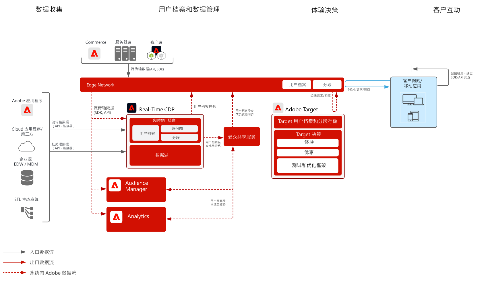

# 行为 Web/移动个性化 Blueprint

根据线上行为和受众数据进行个性化。

## 用例

* 登陆页优化
* 行为定位
* 基于以前的产品/内容视图、产品/内容关联、环境属性、第三方受众数据和人口统计的个性化

## 应用程序

* Adobe Target
* Adobe Analytics（可选）
* Adobe Audience Manager（可选）
* Adobe Real-time Customer Data Platform（可选）

## 架构

## 实施模式

Web/移动个性化 Blueprint 可以通过如下所述方法实现。

1. 使用 [!UICONTROL Platform Web SDK] 或 [!UICONTROL Platform Mobile SDK] 和 [!UICONTROL Edge Network]。[请参阅 Experience Platform Web 和 Mobile SDK Blueprint](../data-ingestion/websdk.md)
1. 使用传统的特定于应用程序的 SDK（例如，AppMeasurement.js）.[请参阅特定于应用程序的SDK Blueprint](../data-ingestion/appsdk.md)

## 实施步骤

1. 为您的 Web 或移动应用程序[实施 Adobe Target](https://experienceleague.adobe.com/docs/target/using/implement-target/implementing-target.html?lang=zh-Hans)。

### 实施步骤 — Audience Manager或Adobe Analytics

1. [实施 Adobe Audience Manager](https://experienceleague.adobe.com/docs/audience-manager/user-guide/implementation-integration-guides/implement-audience-manager.html?lang=zh-Hans)
1. [实施 Adobe Analytics](https://experienceleague.adobe.com/docs/analytics/implementation/home.html?lang=zh-Hans)
1. [实施 Experience Cloud 身份服务](https://experienceleague.adobe.com/docs/id-service/using/implementation/implementation-guides.html?lang=zh-Hans)

   >[!NOTE]
   >
   >每个应用程序都必须使用 Experience Cloud ID，并且必须是同一 Experience Cloud 组织的一部分，以允许应用程序之间共享受众。

1. [请求对人员和受众共享服务的设置（共享受众）](https://www.adobe.com/go/audiences)
1. 在 [Adobe Analytics](https://experienceleague.adobe.com/docs/analytics/components/segmentation/segmentation-workflow/seg-build.html?lang=zh-Hans) 或 [Adobe Audience Manager](https://experienceleague.adobe.com/docs/audience-manager/user-guide/features/segments/segment-builder.html?lang=zh-Hans) 中[构建区段，并配置这些受众以共享到 Experience Cloud](https://experienceleague.adobe.com/docs/analytics/components/segmentation/segmentation-workflow/seg-publish.html?lang=zh-Hans)（如果使用 Audience Manager 或 Adobe Analytics）
1. 受众在 Adobe Target 中可用后，即可用于 [Adobe Target 中的定位体验](https://experienceleague.adobe.com/docs/target/using/audiences/target.html?lang=zh-Hans)

### 实施步骤 — Real-time Customer Data Platform

1. 为要摄入的数据[创建架构。](https://experienceleague.adobe.com/?recommended=ExperiencePlatform-D-1-2021.1.xdm)
1. 为要摄入的数据[创建数据集。](https://experienceleague.adobe.com/docs/platform-learn/tutorials/data-ingestion/create-datasets-and-ingest-data.html?lang=zh-Hans)
1. 在架构上[配置正确的身份和身份命名空间](https://experienceleague.adobe.com/docs/platform-learn/tutorials/identities/label-ingest-and-verify-identity-data.html?lang=zh-Hans)，以确保摄入的数据可以拼接到统一的用户档案中。
1. [为用户档案启用架构和数据集](https://experienceleague.adobe.com/docs/platform-learn/tutorials/profiles/bring-data-into-the-real-time-customer-profile.html?lang=zh-Hans)。
1. [将数据摄入](https://experienceleague.adobe.com/?recommended=ExperiencePlatform-D-1-2020.1.dataingestion&amp;lang=zh-Hans) Experience Platform。
1. 在 Experience Platform 和 Audience Manager 之间[设置 [!UICONTROL Real-time Customer Data Platform] 区段共享](https://www.adobe.com/go/audiences)，以便将 Experience Platform 中定义的受众共享给 Audience Manager。
1. 在 Experience Platform 中[创建区段](https://experienceleague.adobe.com/docs/platform-learn/tutorials/segments/create-segments.html?lang=zh-Hans)。系统自动确定以批次还是流式评估区段。
1. [配置目的地](https://experienceleague.adobe.com/docs/platform-learn/tutorials/destinations/create-destinations-and-activate-data.html?lang=zh-Hans)，以共享用户档案属性和受众成员到所需目的地。

## 相关文档

* [Experience Cloud 受众](https://experienceleague.adobe.com/docs/core-services/interface/audiences/audience-library.html?lang=zh-Hans)
* [将 Audience Manager 与 Adobe Target 集成](https://experienceleague.adobe.com/docs/audience-manager/user-guide/implementation-integration-guides/integration-other-solutions/aam-target-integration.html?lang=zh-Hans)
* [通过 Adobe Audience Manager 分享 Adobe Analytics 区段](https://experienceleague.adobe.com/docs/analytics/components/segmentation/segmentation-workflow/seg-publish.html)
* [[!UICONTROL Real-time Customer Data Platform] 概述](https://experienceleague.adobe.com/docs/platform-learn/tutorials/application-services/rtcdp/understanding-the-real-time-customer-data-platform.html?lang=zh-Hans)
* [[!UICONTROL Real-time Customer Data Platform]产品说明](https://helpx.adobe.com/cn/legal/product-descriptions/real-time-customer-data-platform.html)
* [用户档案和分段指南](https://experienceleague.adobe.com/docs/experience-platform/profile/guardrails.html?lang=zh-Hans)
* [分段文档](https://experienceleague.adobe.com/docs/experience-platform/segmentation/api/streaming-segmentation.html?lang=zh-Hans)
* [目的地文档](https://experienceleague.adobe.com/docs/experience-platform/destinations/catalog/overview.html?lang=zh-Hans)

## 相关博客帖子

* [[!DNL Blueprint for Web Personalization using Adobe Experience Platform Real-Time Customer Profile]](https://medium.com/adobetech/blueprint-for-web-personalization-using-adobe-experience-platform-real-time-customer-profile-fef2ce7a4b2f)
* [[!DNL Integrating Adobe Experience Platform Decisioning Engine with AEM Websites]](https://jaeness.medium.com/integrating-adobe-experience-platform-decisioning-engine-with-aem-websites-9c222acd12e2)
* [[!DNL How Adobe Experience Platform Predictive Audiences improves Personalized Experiences]](https://medium.com/adobetech/how-adobe-experience-platform-predictive-audiences-improves-personalized-experiences-1f75a60cb7a3)
* [[!DNL Adobe Experience Platform Web SDK for Audience Management]](https://medium.com/adobetech/adobe-experience-platform-web-sdk-for-audience-management-751fa6d063bc)
* [[!DNL Implementing Adobe Experience Platform Real-Time Customer Profile through our “Customer Zero” Program]](https://medium.com/adobetech/implementing-adobe-experience-platform-real-time-customer-profile-through-our-customer-zero-32e7cd952896)
* [[!DNL How Adobe Experience Platform Can Help Customers Personalize Their Mobile Messaging in Real-Time with Journey Orchestration Service and a Mobile Messaging Vendor]](https://medium.com/adobetech/how-adobe-experience-platform-helped-a-client-personalize-their-mobile-messaging-in-real-time-with-7d634aefa098)
* [[!DNL Segmentation in Seconds: How Adobe Experience Platform Made Real-time Customer Profiles a Reality]](https://medium.com/adobetech/segmentation-in-seconds-how-adobe-experience-platform-made-real-time-customer-profiles-a-reality-a7a8552b0847)
