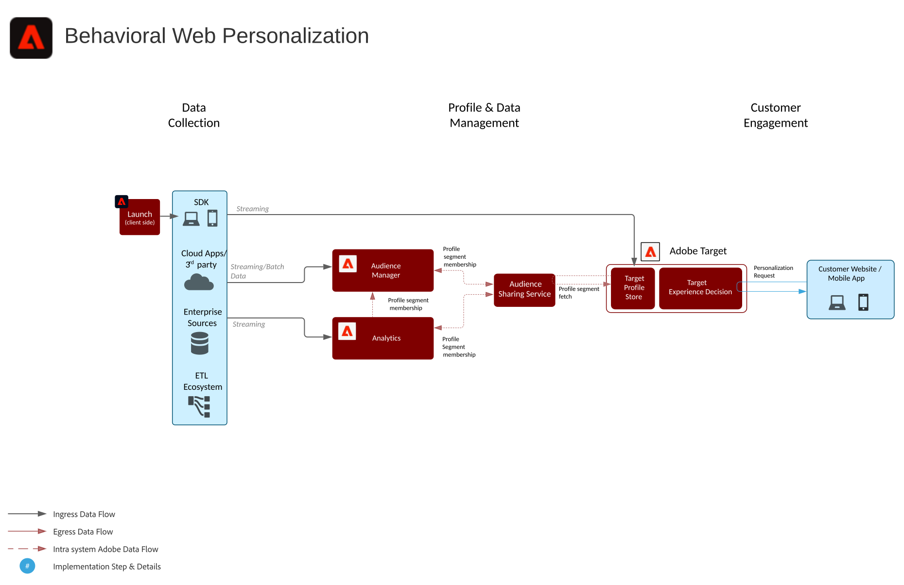
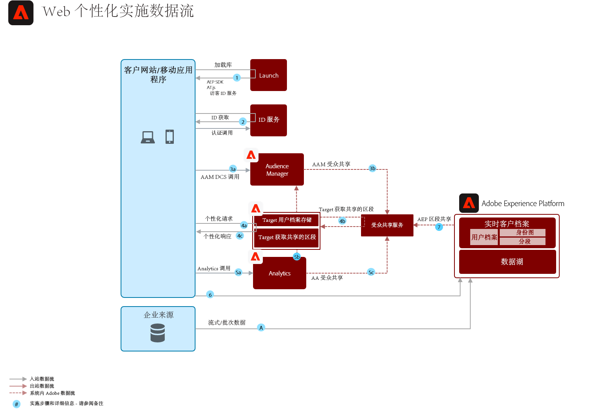

# 行为Web/移动个性化蓝图

根据在线行为和受众数据进行个性化。

## 用例

* 登陆页优化
* 行为定位
* 基于以前的产品/内容视图、产品/内容关联、环境属性、第三方受众数据和人口统计

## 应用程序

* Adobe Target
* Adobe Analytics（可选）
* Adobe Audience Manager（可选）

## 架构

## 瓜德雷尔

默认情况下，区段共享服务允许每个Adobe Analytics报表包最多共享75个受众。 如果Audience Manager用于受众共享，则对可共享的受众数没有限制。 

## 实施模式

Web/移动个性化蓝图可以通过以下方法实现，如下所述。

1. 使用[!UICONTROL Platform Web SDK]或[!UICONTROL Platform Mobile SDK]和[!UICONTROL Edge Network]。
1. 使用传统的特定于应用程序的SDK（例如，AppMeasurement.js）

### 1.平台Web/移动SDK和Edge Approach

### 2.特定于应用程序的SDK方法

## 实施先决条件

| 应用程序/服务 | 所需的库 | 附注 |
|---|---|---|
| Adobe Target | [!UICONTROL 平台Web] SDK*、at.js 0.9.1+或mbox.js 61+ | 首选at.js，因为mbox.js不再在开发中。 |
| Adobe Audience Manager（可选） | [!UICONTROL 平台Web SDK]*或dil.js 5.0+ |  |
| Adobe Analytics（可选） | [!UICONTROL 平台Web SDK]*或AppMeasurement.js 1.6.4+ |  |
| Experience Cloud Identity Service | [!UICONTROL 平台Web SDK]*或VisitorAPI.js 2.0+ |  |
| Experience Platform Mobile SDK（可选） | 适用于iOS和Android™的4.11或更高版本 |  |
| Experience Platform Web SDK | 1.0，当前Experience Platform SDK版本具有[尚未支持Experience Cloud应用程序](https://github.com/adobe/alloy/projects/5)的各种用例 |  |

## 实施步骤

1. [为您的Web](https://experienceleague.adobe.com/docs/target/using/implement-target/implementing-target.html) 或移动应用程序实施Adobe目标。

   如果使用Audience Manager或Adobe Analytics:

1. [实施Adobe Audience Manager](https://experienceleague.adobe.com/docs/audience-manager/user-guide/implementation-integration-guides/implement-audience-manager.html)
1. [实施Adobe Analytics](https://experienceleague.adobe.com/docs/analytics/implementation/home.html)
1. [实施Experience Cloud标识服务](https://experienceleague.adobe.com/docs/id-service/using/implementation/implementation-guides.html)

   >[!NOTE]
   >
   >每个应用程序都必须使用Experience CloudID，并且必须是同一Experience Cloud组织的一部分，以允许应用程序之间共享受众。

1. [请求对人员和受众共享服务的设置(共享受众)](https://www.adobe.com/go/audiences)
1. 在[Adobe Analytics](https://experienceleague.adobe.com/docs/analytics/components/segmentation/segmentation-workflow/seg-build.html)或[Adobe Audience Manager](https://experienceleague.adobe.com/docs/audience-manager/user-guide/features/segments/segment-builder.html)和[中构建区段，并配置这些受众以共享到Experience Cloud](https://experienceleague.adobe.com/docs/analytics/components/segmentation/segmentation-workflow/seg-publish.html)(如果使用Audience Manager或Adobe Analytics)
1. 受众在Adobe Target中可用后，即可用于Adobe Target](https://experienceleague.adobe.com/docs/target/using/audiences/target.html)的[定位体验

## 相关文档

* [Experience Cloud受众](https://experienceleague.adobe.com/docs/core-services/interface/audiences/audience-library.html)
* [将Audience Manager与Adobe Target集成](https://experienceleague.adobe.com/docs/audience-manager/user-guide/implementation-integration-guides/integration-other-solutions/aam-target-integration.html)
* [Adobe Analytics细分共享(通过Adobe Audience Manager)](https://experienceleague.adobe.com/docs/analytics/components/segmentation/segmentation-workflow/seg-publish.html)

## 相关博客帖子

* [[!DNL Blueprint for Web Personalization using Adobe Experience Platform Real-Time Customer Profile]](https://medium.com/adobetech/blueprint-for-web-personalization-using-adobe-experience-platform-real-time-customer-profile-fef2ce7a4b2f)
* [[!DNL Integrating Adobe Experience Platform Decisioning Engine with AEM Websites]](https://jaeness.medium.com/integrating-adobe-experience-platform-decisioning-engine-with-aem-websites-9c222acd12e2)
* [[!DNL How Adobe Experience Platform Predictive Audiences improves Personalized Experiences]](https://medium.com/adobetech/how-adobe-experience-platform-predictive-audiences-improves-personalized-experiences-1f75a60cb7a3)
* [[!DNL Adobe Experience Platform Web SDK for Audience Management]](https://medium.com/adobetech/adobe-experience-platform-web-sdk-for-audience-management-751fa6d063bc)
* [[!DNL Implementing Adobe Experience Platform Real-Time Customer Profile through our “Customer Zero” Program]](https://medium.com/adobetech/implementing-adobe-experience-platform-real-time-customer-profile-through-our-customer-zero-32e7cd952896)
* [[!DNL How Adobe Experience Platform Can Help Customers Personalize Their Mobile Messaging in Real-Time with Journey Orchestration Service and a Mobile Messaging Vendor]](https://medium.com/adobetech/how-adobe-experience-platform-helped-a-client-personalize-their-mobile-messaging-in-real-time-with-7d634aefa098)
* [[!DNL Segmentation in Seconds: How Adobe Experience Platform Made Real-time Customer Profiles a Reality]](https://medium.com/adobetech/segmentation-in-seconds-how-adobe-experience-platform-made-real-time-customer-profiles-a-reality-a7a8552b0847)
