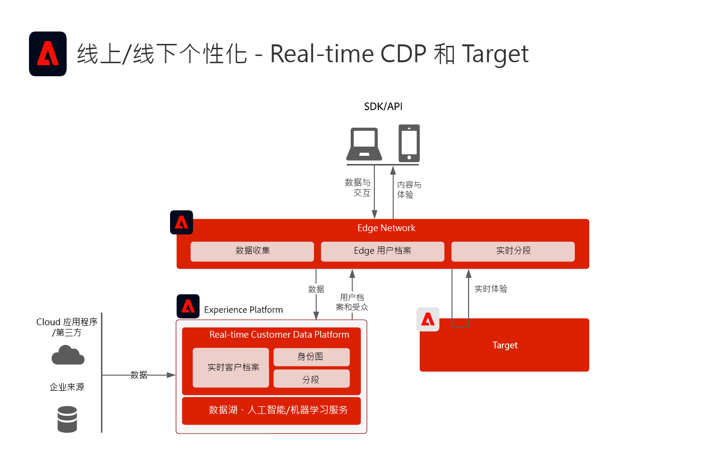
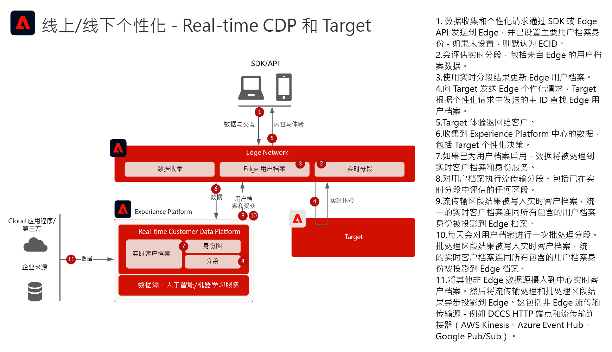
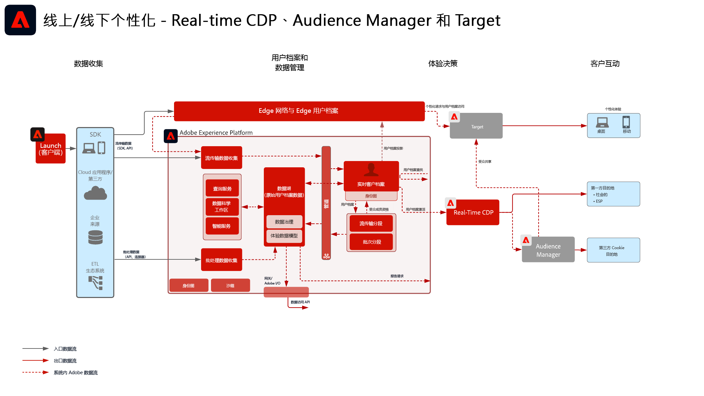

# Web/Mobile Personalization with known customer data

## 用例

* Online personalization with known customer data
* 登陆页优化
* 除线下数据（如交易、预订、CRM 和忠诚度数据）和模型洞察以外，还基于以前的产品/内容视图、产品/内容关联、环境属性和人口统计的个性化
* 使用 Adobe Target 在网站和移动设备应用程序上共享和定位 Real-time Customer Data Platform 中定义的受众。

## 应用程序

* [!UICONTROL Real-time Customer Data Platform]
* Adobe Target
* Adobe Audience Manager（可选）：添加第三方受众数据，基于协作的设备图
* Adobe Analytics（可选）：添加了根据历史行为数据和来自 Adobe Analytics 数据的精细分段来构建区段的功能

## 用例场景

<table class="tg" style="undefined;table-layout: fixed; width: 790px">
<colgroup>
<col style="width: 20px">
<col style="width: 276px">
<col style="width: 229px">
<col style="width: 265px">
</colgroup>
<thead>
  <tr>
    <th class="tg-y6fn">#</th>
    <th class="tg-f7v4">用例场景</th>
    <th class="tg-y6fn">功能</th>
    <th class="tg-f7v4">先决条件</th>
  </tr>
</thead>
<tbody>
  <tr>
    <td class="tg-0lax">1</td>
<td class="tg-73oq">将 Edge 上的实时区段评估从 Real-time Customer Data Platform 共享到 Target</td>
    <td class="tg-0lax">- 在 Edge 上实时评估受众以进行同页或下一页个性化。 - 此外，任何以流传输或批次方式评估的区段也将映射到 Edge 网络，以包含在 Edge 区段评估和个性化中。</td>
    <td class="tg-73oq">- 实施模式 1，如下所述。 - 必须实施 Web/Mobile SDK。 - Note that the Mobile SDK based support for real-time segmentation is not currently available - Datastream must be configured in Experience Edge with the Target and Experience Platform extension enabled, the Datastream ID will be provided in the Target destination configuration. - 必须在 Real-time Customer Data Platform 目标中配置 Target 目标。 - 与 Target 集成需要与 Experience Platform 实例具有相同的 IMS 组织。</td> 
  </tr>
  <tr>
    <td class="tg-0lax">2</td>
    <td class="tg-73oq">通过 Edge 方案将来自 Real-time Customer Data Platform 的流传输受众和批次受众共享到 Target</td>
    <td class="tg-0lax">- 通过 Edge 网络将来自 Real-time Customer Data Platform 的流传输受众和批次受众共享到 Target。要实时评估受众，需要集成模式 1 中概述的 WebSDK 和实时受众评估。 - 此集成通常用于使用传统 SDK 共享流传输受众和批次受众，而不是迁移到 Edge Collection 和 WebSDK，后者支持实时受众以及流传输受众和批次受众，如集成模式 1 中所述。</td>
    <td class="tg-73oq">- 实施模式 1 或 2，如下所述。 - 将流传输受众和批次受众共享到 Target 时，不需要 Web/Mobile SDK，不过实现实时 Edge 区段评估需要它，如集成模式 1 中所述。 - 如果使用 AT.js，则仅支持针对 ECID 身份命名空间的用户档案集成。 - 对于 Edge 上的自定义身份命名空间查找，需要部署 WebSDK，并且必须在身份映射中将每个身份设置为身份。 - 必须在 Experience Edge 中配置数据流，数据流 ID 将在 Target 目标配置中提供。 - 必须在 Real-time Customer Data Platform 目标中配置 Target 目标。 - 与 Target 集成需要与 Experience Platform 实例具有相同的 IMS 组织。</td>
  </tr>
  <tr>
    <td class="tg-0lax">3</td>
    <td class="tg-73oq">通过受众共享服务方案，将流传输和批次受众从 Real-time Customer Data Platform 共享到 Target 和 Audience Manager</td>
    <td class="tg-0lax">- 通过受众共享服务，将流传输和批次受众从 Real-time Customer Data Platform 共享到 Target 和 Audience Manager。 - 当 Audience Manager 中需要通过第三方数据和受众进行额外扩充时，可以利用此集成模式。否则，首选集成模式 1 和 2。要实时评估受众，需要集成模式 1 中概述的 WebSDK 和实时受众评估。</td>
    <td class="tg-73oq">- 实施模式 1 或 2，如下所述。 - 此集成不需要 Web/Mobile SDK 部署。 - 必须配置通过受众共享服务的受众映射。 - 与 Target 集成需要与 Experience Platform 实例具有相同的 IMS 组织。 - 必须将身份解析为 ECID 才能共享到 Edge，以便 Target 对其执行操作。</td>
  </tr>
</tbody>
</table>

## 将实时、流式和批量受众共享到Adobe Target

架构

序列详细信息

概述架构

## 实施模式

Known Customer Personalization is supported via several implementation approaches.

### 实施模式1 — 使用Web/Mobile SDK的边缘网络（推荐方法）

将 Edge 网络与 Web/Mobile SDK 结合使用. 实时边缘分段需要使用Web/Mobile SDK或Edge API实施方法。

[请参阅 Experience Platform Web 和 Mobile SDK Blueprint](../data-ingestion/websdk.md)

### 实施模式2 — 特定于应用程序的SDK

Using traditional application-specific SDKs (for example, AT.js and AppMeasurement.js). 使用此实施方法不支持实时边缘区段评估。 但是，使用此实施方法支持从Experience Platform中心进行流式和批量受众共享。

[请参阅特定于应用程序的SDK Blueprint](../data-ingestion/appsdk.md)

### 实施步骤

1. 为您的 Web 或移动应用程序[实施 Adobe Target](https://experienceleague.adobe.com/docs/target/using/implement-target/implementing-target.html?lang=zh-Hans)
1. [实施 Experience Platform 和[!UICONTROL 实时客户档案]](https://experienceleague.adobe.com/docs/platform-learn/getting-started-for-data-architects-and-data-engineers/overview.html?lang=zh-Hans)通过配置适用的 [合并策略](https://experienceleague.adobe.com/docs/experience-platform/profile/merge-policies/ui-guide.html?lang=zh-Hans#create-a-merge-policy)确保创建的受众在 Edge 上处于活动状态。
1. 实施 [Experience Platform Web SDK](https://experienceleague.adobe.com/docs/experience-platform/edge/home.html?lang=zh-Hans)。Experience Platform Web SDK 是实时 Edge 分段所必需的，但不是将流传输和批次受众从 Real-time Customer Data Platform 共享到 Target 所必需的。请注意，目前不支持通过 Mobile SDK 和 API 进行实时分段。
1. [使用 Edge 数据流配置 Edge 网络](https://experienceleague.adobe.com/docs/experience-platform/edge/fundamentals/datastreams.html?lang=zh-Hans)
1. [在 Real-time Customer Data Platform 中启用 Adobe Target 作为目标](https://experienceleague.adobe.com/docs/experience-platform/destinations/catalog/personalization/adobe-target-connection.html?lang=zh-Hans)
1. (Optional) [Implement Adobe Audience Manager](https://experienceleague.adobe.com/docs/audience-manager/user-guide/implementation-integration-guides/implement-audience-manager.html?lang=zh-Hans) (optional)
1. (Optional) [Request provisioning for Audience Sharing between Experience Platform and Adobe Target (Shared Audiences)](https://www.adobe.com/go/audiences) to share audiences from Experience Platform to Target.

## 护栏

[请参阅“Web 和移动个性化 Blueprint 概述”页面上的护栏。](overview.md)

## 实施注意事项

身份先决条件

* 在 Edge 网络和 WebSDK 中利用上述实施模式 1 时，可以利用任何主身份。首次登录个性化要求个性化请求集主身份与 Real-time Customer Data Platform 中用户档案的主身份匹配。匿名设备与已知客户之间的身份拼接会在中心处理，然后映射到边缘。
* 如上文用例场景 3 中所述，在使用受众共享服务将受众从 Adobe Experience Platform 共享到 Adobe Target 时，需要使用 ECID 作为身份。
* 替代身份也可用于通过Audience Manager将Experience Platform受众共享到Adobe Target。 Experience Platform通过以下受支持的命名空间激活受众以Audience Manager：IDFA、GAID、AdCloud、Google、ECID、EMAIL_LC_SHA256。 请注意，Audience Manager 和 Target 通过 ECID 身份解析受众成员关系，因此要将最终受众共享到 Adobe Target，仍然需要 ECID。

## 相关文档

### SDK 文档

* [Experience Platform Web SDK 文档](https://experienceleague.adobe.com/docs/experience-platform/edge/home.html)
* [Experience Platform 标记文档](https://experienceleague.adobe.com/docs/experience-platform/tags/home.html?lang=zh-Hans)
* [Experience Cloud ID 服务文档](https://experienceleague.adobe.com/docs/id-service/using/home.html?lang=zh-Hans)

### 连接文档

* [用于 Real-time Customer Data Platform 的 Adobe Target 连接](https://experienceleague.adobe.com/docs/experience-platform/destinations/catalog/personalization/adobe-target-connection.html?lang=en)
* [Edge 数据流配置](https://experienceleague.adobe.com/docs/experience-platform/edge/fundamentals/datastreams.html)
* [与 Audience Manager 和其他 Experience Cloud 解决方案共享 Experience Platform 区段](https://experienceleague.adobe.com/docs/audience-manager/user-guide/implementation-integration-guides/integration-experience-platform/aam-aep-audience-sharing.html?lang=zh-Hans)

### 分段文档

* [Experience Platform 分段概述](https://experienceleague.adobe.com/docs/experience-platform/segmentation/home.html?lang=zh-Hans)
* [实时分段](https://experienceleague.adobe.com/docs/experience-platform/segmentation/ui/edge-segmentation.html?lang=zh-Hans)
* [流式分段](https://experienceleague.adobe.com/docs/experience-platform/segmentation/api/streaming-segmentation.html?lang=zh-Hans)
* [通过 Adobe Audience Manager 分享 Adobe Analytics 区段](https://experienceleague.adobe.com/docs/analytics/components/segmentation/segmentation-workflow/seg-publish.html?lang=zh-Hans)
* [合并策略配置](https://experienceleague.adobe.com/docs/experience-platform/profile/merge-policies/ui-guide.html?lang=en#create-a-merge-policy)

### 教程

* [使用 Real-time CDP 和 Adobe Target 实现下一次点击的个性化](https://experienceleague.adobe.com/docs/platform-learn/tutorials/experience-cloud/next-hit-personalization.html?lang=zh-Hans)

### 相关博客帖子

* [Adobe 宣布使用 Adobe Target 和 Real-time Customer Data Platform 实现的同页增强的个性化](https://blog.adobe.com/en/publish/2021/10/05/adobe-announces-same-page-enhanced-personalization-with-adobe-target-real-time-customer-data-platform)
* [[!DNL Blueprint for Web Personalization using Adobe Experience Platform Real-Time Customer Profile]](https://medium.com/adobetech/blueprint-for-web-personalization-using-adobe-experience-platform-real-time-customer-profile-fef2ce7a4b2f)
* [[!DNL Adobe Experience Platform’s Identity Service — How to Solve the Customer Identity Conundrum]](https://medium.com/adobetech/adobe-experience-platforms-identity-service-how-to-solve-the-customer-identity-conundrum-f95e22d16ea9)
* [[!DNL Adobe Experience Platform Web SDK for Audience Management]](https://medium.com/adobetech/adobe-experience-platform-web-sdk-for-audience-management-751fa6d063bc)
* [[!DNL Implementing Adobe Experience Platform Real-Time Customer Profile through our “Customer Zero” Program]](https://medium.com/adobetech/implementing-adobe-experience-platform-real-time-customer-profile-through-our-customer-zero-32e7cd952896)
* [[!DNL Segmentation in Seconds: How Adobe Experience Platform Made Real-time Customer Profiles a Reality]](https://medium.com/adobetech/segmentation-in-seconds-how-adobe-experience-platform-made-real-time-customer-profiles-a-reality-a7a8552b0847)
