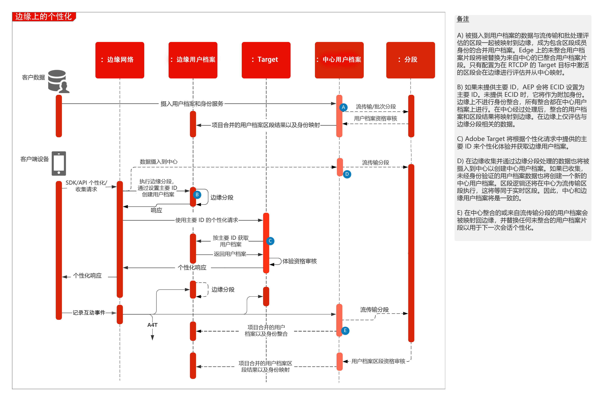

# 使用线上和线下数据进行 Web/移动个性化

将 Web 个性化与电子邮件和其他已知和匿名渠道的个性化同步。

## 用例

* 登陆页优化
* 行为和线下用户档案定位
* 除线下洞察（如交易、预订、CRM 和忠诚度数据）和模型洞察以外，还基于以前的产品/内容视图、产品/内容关联、环境属性、第三方受众数据和人口统计的个性化
* 使用 Adobe Target 在网站和移动设备应用程序上共享和定位 Real-time Customer Data Platform 中定义的受众。

## 应用程序

* [!UICONTROL Real-time Customer Data Platform]
* Adobe Target
* Adobe Audience Manager（可选）：添加了第三方受众数据，基于合作社的设备图，在 Adobe Analytics 中显示 Platform 区段功能以及在 Platform 中显示 Adobe Analytics 区段的功能
* Adobe Analytics（可选）：添加了根据历史行为数据和来自 Adobe Analytics 数据的精细分段来构建区段的功能

## 集成模式

<table class="tg" style="undefined;table-layout: fixed; width: 790px">
<colgroup>
<col style="width: 20px">
<col style="width: 276px">
<col style="width: 229px">
<col style="width: 265px">
</colgroup>
<thead>
  <tr>
    <th class="tg-y6fn">#</th>
    <th class="tg-f7v4">集成模式</th>
    <th class="tg-y6fn">功能</th>
    <th class="tg-f7v4">先决条件</th>
  </tr>
</thead>
<tbody>
  <tr>
    <td class="tg-0lax">1</td>
    <td class="tg-73oq">通过受众共享服务方法，将 RTCDP 流传输和批次受众共享到 Target 和 Audience Manager</td>
    <td class="tg-0lax"> - 通过受众共享服务，将流传输和批次受众从 RTCDP 共享到 Target 和 Audience Manager。要实时评估受众，需要集成模式 3 中概述的 WebSDK 和实时受众评估。</td>
    <td class="tg-73oq"> - 必须配置通过受众共享服务的受众投影。 - 与 Target 集成需要与 Experience Platform 实例具有相同的 IMS 组织。 - 必须将身份解析为 ECID 才能共享到 Edge，以便 Target 对其执行操作。AAM 具有单独的已批准身份列表可用于匹配  - 此集成不需要 WebSDK 部署。</td>
  </tr>
  <tr>
    <td class="tg-0lax">2</td>
    <td class="tg-73oq">通过 Edge 方法将 RTCDP 流传输和批次受众共享到 Target</td>
    <td class="tg-0lax"> - 通过 Edge Network 将流传输和批次受众从 RTCDP 共享到 Target。要实时评估受众，需要集成模式 3 中概述的 WebSDK 和实时受众评估。</td>
    <td class="tg-73oq"> — 必须在RTCDP目标中配置Target目标。 - 与 Target 集成需要与 Experience Platform 实例具有相同的 IMS 组织。 不需要 WebSDK。支持 WebSDk 和 AT.js。 - 如果使用 AT.js，则仅支持针对 ECID 的用户档案查找。 - 对于 Edge 上的自定义 ID 命名空间查找，需要部署 WebSDK，并且必须在身份映射中将每个身份设置为身份。</td>
  </tr>
  <tr>
    <td class="tg-0lax">3</td>
    <td class="tg-73oq">在使用 WebSDK 通过 Edge Network 共享到 Target 的 Edge 上进行 RTCDP 实时区段评估。</td>
    <td class="tg-0lax"> - 在 Edge 上实时评估受众以进行同页或下一页个性化。</td>
    <td class="tg-73oq"> — 必须在RTCDP目标中配置Target目标。 - 与 Target 集成需要与 Experience Platform 实例具有相同的 IMS 组织。 - 必须实施 WebSDK。 - 也通过 API 支持。</td>
  </tr>
</tbody>
</table>

## 架构

概述架构

流程架构

 

详细架构

## 护栏

[请参阅“Web 和移动个性化 Blueprint 概述”页面上的护栏。](overview.md)

## 实施模式

Web/移动个性化 Blueprint 可以通过如下所述方法实现。

1. 使用 [!UICONTROL Platform Web SDK] 或 [!UICONTROL Platform Mobile SDK] 和 [!UICONTROL Edge Network]。
1. 使用传统的特定于应用程序的 SDK（例如，AppMeasurement.js）

### 1. Platform Web/移动 SDK 和 Edge 方法

[请参阅 Experience Platform Web 和 Mobile SDK Blueprint](../data-ingestion/websdk.md)

### 2. 特定于应用程序的 SDK 方法

## 实施先决条件

身份先决条件

* 从 Adobe Experience Platform 将受众共享到 Adobe Target 需要使用 ECID 作为身份。
* 替代身份也可用于通过Audience Manager将Experience Platform受众共享到Adobe Target。 Experience Platform通过以下受支持的命名空间激活受众以Audience Manager：IDFA、GAID、AdCloud、Google、ECID、EMAIL_LC_SHA256。 请注意，Audience Manager 和 Target 通过 ECID 身份解析受众成员关系，因此要将最终受众共享到 Adobe Target，仍然需要 ECID。

| 应用程序/服务 | 所需的库 | 备注 |
|---|---|---|
| Adobe Target | [!UICONTROL Platform Web SDK]*、at.js 0.9.1+ 或 mbox.js 61+ | 首选 at.js，因为 mbox.js 将不再开发。 |
| Adobe Audience Manager（可选） | [!UICONTROL Platform Web SDK]* 或 dil.js 5.0+ |  |
| Adobe Analytics（可选） | [!UICONTROL Platform Web SDK]* 或 AppMeasurement.js 1.6.4+ | Adobe Analytics 跟踪必须使用区域数据收集 (RDC)。 |
| Experience Cloud ID 服务 | [!UICONTROL Platform Web SDK]* 或 VisitorAPI.js 2.0+ | （推荐）使用 Experience Platform Launch 部署 ID 服务，以确保在任何应用程序调用之前已设置 ID。 |
| Experience Platform Mobile SDK（可选） | 适用于 Android™ 和 iOS 的 4.11 或更高版本 |  |
| Experience Platform Web SDK | 1.0，当前 Experience Platform SDK 版本具有[尚未支持 Experience Cloud 应用程序的各种用例](https://github.com/adobe/alloy/projects/5) |  |

## 实施步骤

1. 为您的 Web 或移动应用程序[实施 Adobe Target](https://experienceleague.adobe.com/docs/target/using/implement-target/implementing-target.html?lang=zh-Hans)
1. [实施 Adobe Audience Manager](https://experienceleague.adobe.com/docs/audience-manager/user-guide/implementation-integration-guides/implement-audience-manager.html?lang=zh-Hans)（可选）
1. [实施 Adobe Analytics](https://experienceleague.adobe.com/docs/analytics/implementation/home.html?lang=zh-Hans)（可选）
1. [实施 Experience Platform 和[!UICONTROL 实时客户档案]](https://experienceleague.adobe.com/docs/platform-learn/getting-started-for-data-architects-and-data-engineers/overview.html?lang=zh-Hans)
1. 实施 [Experience Cloud Identity 服务](https://experienceleague.adobe.com/docs/id-service/using/implementation/implementation-guides.html?lang=zh-Hans)或者 [Experience Platform Web SDK](https://experienceleague.adobe.com/docs/experience-platform/edge/home.html?lang=zh-Hans)
1. [在 Real-time Customer Data Platform 中启用将 Adobe Target 作为目标](https://experienceleague.adobe.com/docs/experience-platform/destinations/catalog/personalization/adobe-target-connection.html?lang=zh-Hans)或用于受众共享方法 [请求为 Experience Platform 与 Adobe Target 之间的受众共享进行配置（共享受众）](https://www.adobe.com/go/audiences)以便将受众从 Experience Platform 共享到 Target。
   >[!NOTE]
   >
   >在 RTCDP 和 Adobe Target 之间使用受众共享服务时，受众必须使用 Experience Cloud ID 共享，并且属于同一 Experience Cloud 组织。要支持 ECID 以外的身份，需要使用 WebSDK 和 Experience Edge Network。

## 相关文档

* [与 Audience Manager 和其他 Experience Cloud 解决方案共享 Experience Platform 区段](https://experienceleague.adobe.com/docs/audience-manager/user-guide/implementation-integration-guides/integration-experience-platform/aam-aep-audience-sharing.html?lang=zh-Hans)
* [Experience Platform 分段概述](https://experienceleague.adobe.com/docs/experience-platform/segmentation/home.html?lang=zh-Hans)
* [流式分段](https://experienceleague.adobe.com/docs/experience-platform/segmentation/api/streaming-segmentation.html?lang=zh-Hans)
* [用于 Real-time Customer Data Platform 的 Adobe Target 连接](https://experienceleague.adobe.com/docs/experience-platform/destinations/catalog/personalization/adobe-target-connection.html?lang=en)
* [Experience Platform 区段生成器概述](https://experienceleague.adobe.com/docs/experience-platform/segmentation/ui/overview.html?lang=zh-Hans)
* [Audience Manager 源连接器](https://experienceleague.adobe.com/docs/experience-platform/sources/connectors/adobe-applications/audience-manager.html?lang=zh-Hans)
* [通过 Adobe Audience Manager 分享 Adobe Analytics 区段](https://experienceleague.adobe.com/docs/analytics/components/segmentation/segmentation-workflow/seg-publish.html?lang=zh-Hans)
* [Experience Platform Web SDK 文档](https://experienceleague.adobe.com/docs/experience-platform/edge/home.html)
* [Experience Cloud ID 服务文档](https://experienceleague.adobe.com/docs/id-service/using/home.html?lang=zh-Hans)
* [Experience Platform 标记文档](https://experienceleague.adobe.com/docs/experience-platform/tags/home.html?lang=zh-Hans)

## 相关博客帖子

* [[!DNL Blueprint for Web Personalization using Adobe Experience Platform Real-Time Customer Profile]](https://medium.com/adobetech/blueprint-for-web-personalization-using-adobe-experience-platform-real-time-customer-profile-fef2ce7a4b2f)
* [[!DNL Build an Optimal Online Experience: Enrich Unified Profile with Query Service]](https://medium.com/adobetech/build-an-optimal-online-experience-enrich-unified-profile-with-query-service-8027c196ab33)
* [[!DNL Integrating Adobe Experience Platform Decisioning Engine with AEM Websites]](https://jaeness.medium.com/integrating-adobe-experience-platform-decisioning-engine-with-aem-websites-9c222acd12e2)
* [[!DNL Adobe Experience Platform’s Identity Service — How to Solve the Customer Identity Conundrum]](https://medium.com/adobetech/adobe-experience-platforms-identity-service-how-to-solve-the-customer-identity-conundrum-f95e22d16ea9)
* [[!DNL How Adobe Experience Platform Predictive Audiences improves Personalized Experiences]](https://medium.com/adobetech/how-adobe-experience-platform-predictive-audiences-improves-personalized-experiences-1f75a60cb7a3)
* [[!DNL Adobe Experience Platform Web SDK for Audience Management]](https://medium.com/adobetech/adobe-experience-platform-web-sdk-for-audience-management-751fa6d063bc)
* [[!DNL Implementing Adobe Experience Platform Real-Time Customer Profile through our “Customer Zero” Program]](https://medium.com/adobetech/implementing-adobe-experience-platform-real-time-customer-profile-through-our-customer-zero-32e7cd952896)
* [[!DNL How Adobe Experience Platform Can Help Customers Personalize Their Mobile Messaging in Real-Time with Journey Orchestration Service and a Mobile Messaging Vendor]](https://medium.com/adobetech/how-adobe-experience-platform-helped-a-client-personalize-their-mobile-messaging-in-real-time-with-7d634aefa098)
* [[!DNL Segmentation in Seconds: How Adobe Experience Platform Made Real-time Customer Profiles a Reality]](https://medium.com/adobetech/segmentation-in-seconds-how-adobe-experience-platform-made-real-time-customer-profiles-a-reality-a7a8552b0847)
* [[!DNL Build an Optimal Online Experience: Enrich Unified Profile with Query Service]](https://medium.com/adobetech/build-an-optimal-online-experience-enrich-unified-profile-with-query-service-8027c196ab33)
