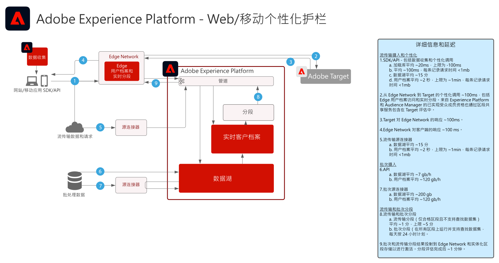

# Web和移动个性化蓝图

Web 和移动个性化解决了跨多个应用程序使用用户档案和受众分段来个性化和优化客户体验的问题。可以利用客户行为、人口统计、忠诚度级别和过往交易记录来个性化布局、行动号召和内容。

 

| Blueprint | 描述 | Experience Cloud 应用程序 |
|---|---|---|
| **[行为 Web/移动个性化](behavioral.md)** | <ul><li>根据在线行为和受众数据进行个性化。</li></ul> | <ul><li>Adobe Target</li><li>Adobe Real-time Customer Data Platform *（可选）*</li><li>Adobe Analytics *（可选）*</li><li>Adobe Audience Manager *（可选）*</li></ul> |
| **[使用已知客户数据的 Web/移动个性化](known-personalization.md)** | <ul><li>完整的客户用户档案和增强的分段可提供更好的个性化体验。</li><li>利用离线属性和事件（交易、预订、CRM 和忠诚度数据）进行个性化设置。</li><li>在网络、电子邮件和其他已知渠道之间同步个性化。</li></ul> | <ul><li>Adobe Target</li><li>[!UICONTROL Real-time Customer Data Platform]</li><li>Adobe Analytics 或 Customer Journey Analytics *（可选）*</li><li>Adobe Audience Manager *（可选）*</li></ul> |

 

## Web 和移动个性化护栏

[有关受众和用户档案激活的护栏，请参阅用户档案和分段护栏文档。](https://experienceleague.adobe.com/docs/experience-platform/profile/guardrails.html?lang=zh-Hans)

 

### 已知客户个性化护栏图

## 相关博客帖子

* [[!DNL Blueprint for Web Personalization using Adobe Experience Platform Real-Time Customer Profile]](https://medium.com/adobetech/blueprint-for-web-personalization-using-adobe-experience-platform-real-time-customer-profile-fef2ce7a4b2f)
* [[!DNL Integrating Adobe Experience Platform Decisioning Engine with AEM Websites]](https://jaeness.medium.com/integrating-adobe-experience-platform-decisioning-engine-with-aem-websites-9c222acd12e2)
* [[!DNL Content and Commerce AI: Personalizing Your Interactions with Customers Through Content Intelligence]](https://medium.com/adobetech/content-and-commerce-ai-personalizing-your-interactions-with-customers-through-content-intelligence-dc182601deab)
* [[!DNL Implementing Adobe Experience Platform Real-Time Customer Profile through our "Customer Zero" Program]](https://medium.com/adobetech/implementing-adobe-experience-platform-real-time-customer-profile-through-our-customer-zero-32e7cd952896)
* [[!DNL Segmentation in Seconds: How Adobe Experience Platform Made Real-time Customer Profiles a Reality]](https://medium.com/adobetech/segmentation-in-seconds-how-adobe-experience-platform-made-real-time-customer-profiles-a-reality-a7a8552b0847)
* [[!DNL Build an Optimal Online Experience: Enrich Unified Profile with Query Service]](https://medium.com/adobetech/build-an-optimal-online-experience-enrich-unified-profile-with-query-service-8027c196ab33)
